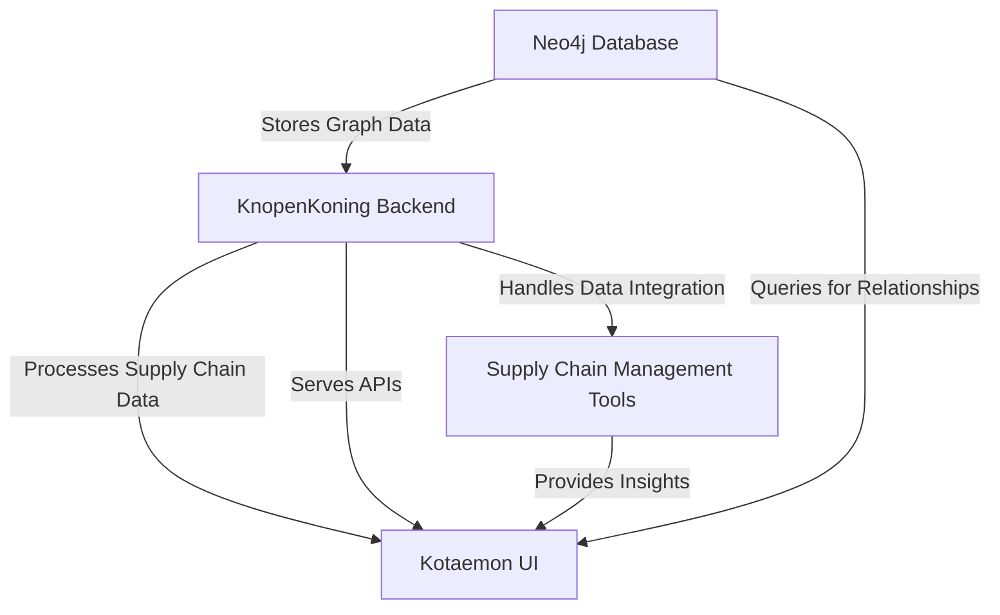

# VCH-Infra

```mermaid
graph TD
    A[Neo4j Database] -->|Stores Graph Data| B[KnopenKoning Backend]
    B -->|Processes Supply Chain Data| C[Kotaemon UI]
    B -->|Serves APIs| C
    A -->|Queries for Relationships| C
    B -->|Handles Data Integration| D[Supply Chain Management Tools]
    D -->|Provides Insights| C
```

