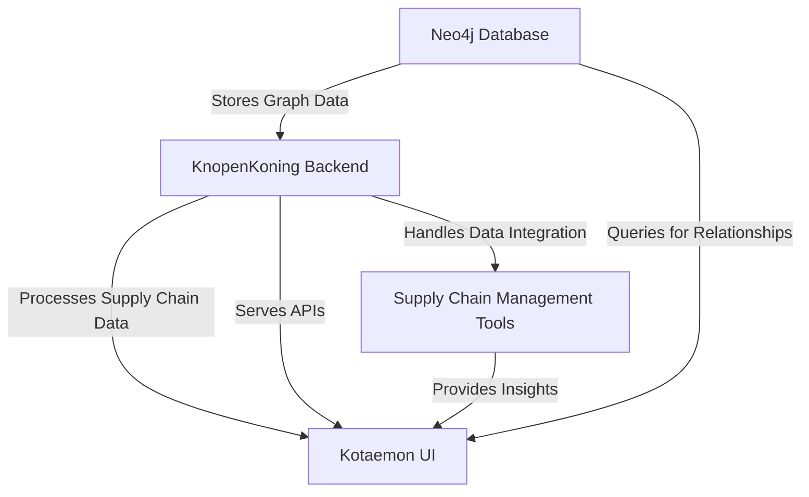
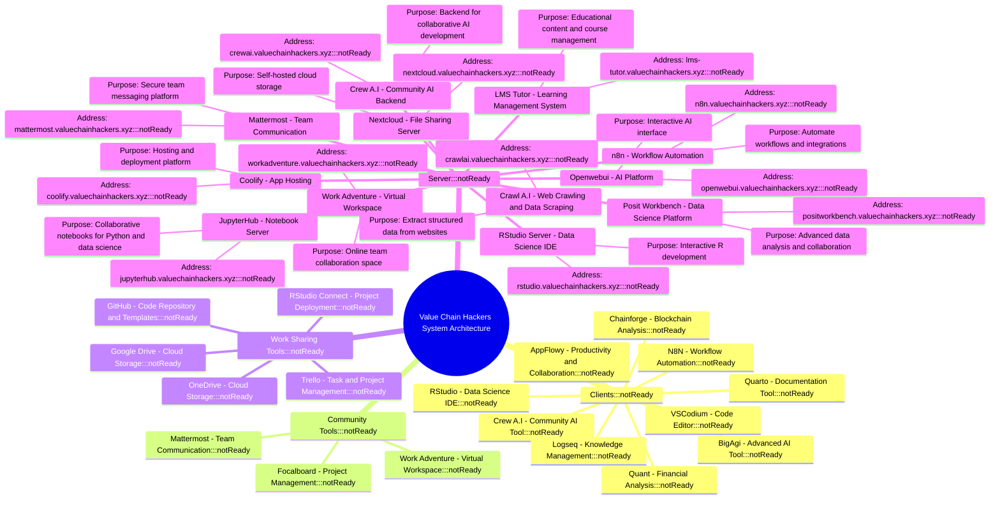

# VCH-Infra

here is an overview

Server IP: 148.251.4.42

| **Service Name**       | **Purpose**                          | **Address**                                                    | **Status**       |
|-------------------------|--------------------------------------|----------------------------------------------------------------|------------------|
| **Openwebui**          | AI Platform                         | [https://openwebui.valuechainhackers.xyz](https://openwebui.valuechainhackers.xyz)    | Not Ready        |
| **Coolify**            | App Hosting                         | [https://coolify.valuechainhackers.xyz](https://coolify.valuechainhackers.xyz)      | Not Ready        |
| **Nextcloud**          | File Sharing Server                 | [https://nextcloud.valuechainhackers.xyz](https://nextcloud.valuechainhackers.xyz)    | Not Ready        |
| **Work Adventure**     | Virtual Workspace                   | [https://workadventure.valuechainhackers.xyz](https://workadventure.valuechainhackers.xyz) | Not Ready        |
| **n8n**                | Workflow Automation                 | [https://n8n.valuechainhackers.xyz](https://n8n.valuechainhackers.xyz)              | Not Ready        |
| **Posit Workbench**    | Data Science Platform               | [https://positworkbench.valuechainhackers.xyz](https://positworkbench.valuechainhackers.xyz) | Not Ready        |
| **RStudio Server**     | Data Science IDE                    | [https://rstudio.valuechainhackers.xyz](https://rstudio.valuechainhackers.xyz)      | Not Ready        |
| **JupyterHub**         | Notebook Server                     | [https://jupyterhub.valuechainhackers.xyz](https://jupyterhub.valuechainhackers.xyz) | Not Ready        |
| **Mattermost**         | Team Communication                  | [https://mattermost.valuechainhackers.xyz](https://mattermost.valuechainhackers.xyz) | Not Ready        |
| **Crawl A.I**          | Web Crawling and Data Scraping      | [https://crawlai.valuechainhackers.xyz](https://crawlai.valuechainhackers.xyz)      | Not Ready        |
| **Crew A.I**           | Community AI Backend                | [https://crewai.valuechainhackers.xyz](https://crewai.valuechainhackers.xyz)        | Not Ready        |
| **LMS Tutor**          | Learning Management System          | [https://lms-tutor.valuechainhackers.xyz](https://lms-tutor.valuechainhackers.xyz)  | Not Ready        |
| **Kotaemon**           | Assessment and Evaluation System    | [https://kotaemon.valuechainhackers.xyz](https://kotaemon.valuechainhackers.xyz)    | Not Ready        |
| **Neo4j**              | Graph Database                      | [https://neo4j.valuechainhackers.xyz](https://neo4j.valuechainhackers.xyz)          | Not Ready        |

### ValueChain Hackers Operating System (VCHOS)

Looking for an operating system that’s built for innovation and impact? **VCHOS** is a Linux-based platform tailored for hackers, developers, and value-chain innovators. It provides **pre-configured environments** for data science, journalism, and finance, cutting setup time so you can focus on solving real problems. Fully customizable, modular, and privacy-first, VCHOS empowers you to work smarter, collaborate better, and extend the life of your hardware. 

The **ValueChain Hackers Operating System (VCHOS)** is a specialized Linux-based ecosystem designed to empower hackers, developers, and innovators working across value chains. By integrating lightweight, modular tools with pre-configured environments, VCHOS simplifies complex workflows, reduces configuration overhead, and accelerates productivity.

#### Key Features:
- **Pre-Built Environments:** Tailored setups for roles like data scientists, journalists, and finance professionals.
- **Customization and Modularity:** Easily adaptable to specific use cases within value chains.
- **Open-Source Collaboration:** Encourages community-driven enhancements and tool integration.
- **Privacy and Sustainability:** Prioritizes user control, data security, and extending hardware life.

VCHOS represents a streamlined, collaborative approach to solving value-chain challenges while fostering inclusivity and innovation in the open-source community.

**Get started with VCHOS and redefine how you innovate!**

# Essential Software for Students and Startups

| **Software Name**   | **Purpose**                              | **Associated Processes**                                                                                               | **Website**                               | **GitHub Repository**                           |
|---------------------|------------------------------------------|------------------------------------------------------------------------------------------------------------------------|--------------------------------------------|-------------------------------------------------|
| **Kotaemon**        | Chat with documents using RAG            | Research and Development, Knowledge Management                                                                         | [Kotaemon](https://cinnamon.github.io/kotaemon/) | [Kotaemon GitHub](https://github.com/Cinnamon/kotaemon) |
| **OpenWebUI**       | Self-hosted AI platform                  | Research and Development, Data Collection, Experimentation                                                             | [OpenWebUI](https://docs.openwebui.com/)   | [OpenWebUI GitHub](https://github.com/open-webui/open-webui) |
| **Crew A.I**        | Collaboration of AI agents               | Research and Development, Team Collaboration                                                                           | [Crew A.I](https://crew.ai)                | [Crew A.I GitHub](https://github.com/crewAIInc/crewAI-examples) |
| **Quant**           | Financial analysis and modeling          | Business Planning, Budgeting and Financial Planning                                                                    | [Quant](https://quant.com)                 | Not available                                   |
| **BigAgi**          | Advanced AI tool                         | Research and Development, Prototyping                                                                                  | [BigAgi](https://bigagi.com)               | Not available                                   |
| **AppFlowy**        | Open-source Notion alternative           | Knowledge Management, Documentation, Collaboration                                                                     | [AppFlowy](https://appflowy.io)            | [AppFlowy GitHub](https://github.com/AppFlowy-IO/appflowy) |
| **Logseq**          | Knowledge management and note-taking     | Knowledge Management, Documentation, Research                                                                          | [Logseq](https://logseq.com)               | [Logseq GitHub](https://github.com/logseq/logseq) |
| **Chainforge**      | Blockchain analysis                      | Research and Development, Prototyping                                                                                  | [Chainforge](https://chainforge.com)       | Not available                                   |
| **N8N**             | Workflow automation                      | Project Management, Task Automation, Data Collection                                                                   | [N8N](https://n8n.io)                      | [N8N GitHub](https://github.com/n8n-io/n8n)      |
| **RStudio**         | Data science IDE                         | Research and Development, Experimentation, Prototyping                                                                 | [RStudio](https://rstudio.com)             | [RStudio GitHub](https://github.com/rstudio/rstudio) |
| **Quarto**          | Scientific and technical publishing      | Documentation, Knowledge Sharing                                                                                       | [Quarto](https://quarto.org)               | [Quarto GitHub](https://github.com/quarto-dev/quarto-cli) |
| **LabPlot**         | Scientific plotting and data analysis    | Research and Development, Data Visualization                                                                           | [LabPlot](https://labplot.kde.org)         | [LabPlot GitHub](https://invent.kde.org/education/labplot) |
| **Cantor**          | Interface for mathematical software      | Research and Development, Experimentation                                                                              | [Cantor](https://cantor.kde.org)           | [Cantor GitHub](https://invent.kde.org/education/cantor) |
| **KStars**          | Astronomy software                       | Research and Development, Data Analysis                                                                                | [KStars](https://kstars.kde.org)           | [KStars GitHub](https://invent.kde.org/education/kstars) |
| **RKWard**          | GUI for R programming                    | Research and Development, Data Analysis                                                                                | [RKWard](https://rkward.kde.org)           | [RKWard GitHub](https://invent.kde.org/education/rkward) |
| **Kile**            | LaTeX editor                             | Documentation, Report Writing                                                                                          | [Kile](https://kile.kde.org)               | [Kile GitHub](https://invent.kde.org/office/kile) |
| **KmPlot**          | Mathematical function plotter            | Research and Development, Data Visualization                                                                           | [KmPlot](https://kmplot.kde.org)           | [KmPlot GitHub](https://invent.kde.org/education/kmplot) |
| **Kalzium**         | Periodic table of elements               | Research and Development, Education                                                                                   | [Kalzium](https://kalzium.kde.org)         | [Kalzium GitHub](https://invent.kde.org/education/kalzium) |
| **Step**            | Interactive physics simulator            | Research and Development, Experimentation                                                                              | [Step](https://step.kde.org)               | [Step GitHub](https://invent.kde.org/education/step) |
| **Rocs**            | Graph theory IDE                         | Research and Development, Data Analysis                                                                                | [Rocs](https://rocs.kde.org)               | [Rocs GitHub](https://invent.kde.org/education/rocs) |
| **Mattermost**      | Team communication platform              | Team Collaboration, Communication                                                                                      | [Mattermost](https://mattermost.com)       | [Mattermost GitHub](https://github.com/mattermost/mattermost-server) |
| **Work Adventure**  | Virtual workspace                        | Team Collaboration, Virtual Meetings                                                                                   | [Work Adventure](https://workadventu.re)   | [Work Adventure GitHub](https://github.com/thecodingmachine/workadventure) |
| **Focalboard**      | Open-source project management           | Project Management, Task Tracking                                                                                      | [Focalboard](https://focalboard.com)       | [Focalboard GitHub](https://github.com/mattermost/focalboard) |
| **Trello**          | Task and project management              | Project Management, Task Tracking                                                                                      | [Trello](https://trello.com)               | Not available                                   |
| **GitHub Desktop**  | GitHub repository management             | Version Control, Code Management                                                                                       | [GitHub Desktop](https://desktop.github.com) | [GitHub Desktop GitHub](https://github.com/desktop/desktop) |
| **OneDrive**        | Cloud storage                            | File Storage, Backup                                                                                                   | [OneDrive](https://onedrive.live.com)      | Not available                                   |
| **Google Drive**    | Cloud storage                            | File Storage, Collaboration                                                                                            | [Google Drive](https://drive.google.com)   | Not available                                   |

## Executive Summary

Christiaan Verhoef is leading multiple interconnected initiatives focused on improving Linux adoption, fostering open-source communities, and empowering users through education and sustainability. These efforts aim to streamline Linux deployment, enhance collaboration in open-source ecosystems, and address user frustrations with proprietary software ecosystems.

---

## Key Initiatives and Progress

### 1. **Mass Deployment and Simplified Ecosystems**
- **Objective:** Create a seamless, user-friendly Linux experience for mass adoption.
- **Actions Taken:**
  - Experimenting with custom Debian-based solutions, including pre-configured packages for specific roles (e.g., journalists, data scientists, finance professionals).
  - Investigating the use of Debian Pure Blends to develop tailored distributions for various user groups.
  - Built a prototype ISO (`debian-current-netinst.iso`) that simplifies deployment but noted challenges with larger packages.

---

### 2. **Community and Contributor Engagement**
- **Objective:** Build a collaborative network to support ecosystem development.
- **Actions Taken:**
  - Engaging with Debian Blends and KDE communities to share and refine ideas.
  - Networking with potential contributors from hackerspaces (e.g., Bitlair) and academic institutions (e.g., Windesheim Zwolle and Almere).
  - Proposed use-case ideas at Birds of a Feather (BoF) sessions to gather input and refine project directions.

---

### 3. **Linux Advocacy and Transition Support**
- **Objective:** Advocate for Linux as an alternative to proprietary systems and simplify the transition for new users.
- **Actions Taken:**
  - Highlighting the benefits of Linux (e.g., privacy, cost-effectiveness, sustainability) to users frustrated by mainstream ecosystems.
  - Developing pre-built workflows and resources to make adoption easy for individuals and organizations.
  - Targeting specific user groups (e.g., journalists, non-profits) with tailored solutions to address their unique challenges.

---

### 4. **Education and Empowerment**
- **Objective:** Empower users through education and self-sufficiency.
- **Actions Taken:**
  - Creating guides and resources for organizations to maintain and update systems independently.
  - Advocating for methodologies that emphasize hands-on learning and user empowerment.
  - Collaborating with educators and organizations to ensure that solutions align with user needs.

---

### 5. **Sustainability and Inclusivity**
- **Objective:** Promote sustainability and inclusivity through open-source solutions.
- **Actions Taken:**
  - Advocating for the reuse of older hardware by transitioning to lightweight Linux distributions.
  - Addressing digital inequities by providing affordable, accessible tools for non-profits and underfunded organizations.
  - Aligning efforts with broader sustainability goals, such as reducing electronic waste and supporting financial savings.

---

## Challenges and Next Steps

### Challenges
- Integrating larger custom packages into ISO deployments.
- Encouraging community contributions and maintaining momentum in open-source projects.
- Balancing technical complexity with user-friendliness for new adopters.

### Next Steps
1. Refine the ISO deployment process for better scalability.
2. Continue engaging with open-source communities (Debian, KDE) to gather feedback and improve solutions.
3. Develop more targeted educational resources and workflows for specific user groups.
4. Strengthen outreach efforts to attract contributors and expand the network.

---

# Core Startup Processes for Value Chain Hackers

## 1. Ideation and Research
- **Market Research**:
  - Identify industry trends and customer pain points.
  - Analyze competitors and market gaps.
- **Innovation Workshops**:
  - Brainstorm potential solutions and opportunities.
- **Feasibility Studies**:
  - Assess technical and economic feasibility of the proposed ideas.

### Innovation Workshops
- **Tools**: Mattermost, Work Adventure, Logseq.
  - **Mattermost**: Enables team discussions and brainstorming.
  - **Work Adventure**: Provides a virtual collaboration environment for workshops.
  - **Logseq**: Allows participants to document and structure ideas.
  - **Gap**: Limited support for advanced workshop facilitation like interactive polling or idea ranking.

### Feasibility Studies
- **Tools**: Quant, RStudio, Logseq.
  - **Quant**: Excellent for financial feasibility and modeling.
  - **RStudio**: Supports statistical analysis and visualization.
  - **Logseq**: Useful for documenting analysis and insights.
  - **Gap**: No dedicated support for integrating technical feasibility assessments.

---

## 2. Business Planning
- **Business Model Development**:
  - Define the value proposition, customer segments, and revenue streams.
- **Budgeting and Financial Planning**:
  - Create forecasts, budgets, and funding requirements.
- **Pitch Deck Creation**:
  - Develop presentations for potential investors or stakeholders.

### Business Model Development
- **Tools**: Logseq, AppFlowy.
  - **Logseq**: Useful for outlining and iterating on business models.
  - **AppFlowy**: Offers collaborative capabilities for planning and brainstorming.
  - **Gap**: No templates or structured guidance for business model creation.

### Budgeting and Financial Planning
- **Tools**: Quant, RStudio.
  - **Quant**: Highly effective for financial modeling and projections.
  - **RStudio**: Provides tools for in-depth financial data analysis.
  - **Gap**: Lacks user-friendly interfaces for non-technical users to manage budgets.

### Pitch Deck Creation
- **Tools**: Quarto.
  - **Quarto**: Can generate professional reports and presentations.
  - **Gap**: Does not support drag-and-drop pitch deck creation for non-technical users.
---

## 3. Team Formation and Collaboration
- **Team Recruitment**:
  - Assemble a team of researchers, developers, and marketers.
- **Role Assignment**:
  - Define roles and responsibilities.
- **Collaboration Tools**:
  - Use platforms like Mattermost or Work Adventure for team communication and virtual collaboration.

### Team Recruitment
- **Tools**: Mattermost.
  - **Mattermost**: Facilitates communication with prospective team members.
  - **Gap**: Does not handle recruitment processes (e.g., application tracking).

### Role Assignment
- **Tools**: Mattermost, Focalboard.
  - **Mattermost**: Enables discussion on roles and responsibilities.
  - **Focalboard**: Tracks tasks and assigns them to team members.
  - **Gap**: Limited tools for hierarchical role visualization.

### Collaboration Tools
- **Tools**: Mattermost, Work Adventure, Focalboard.
  - **Mattermost**: Supports real-time team communication.
  - **Work Adventure**: Provides a virtual workspace for collaboration.
  - **Focalboard**: Useful for managing collaborative tasks.
  - **Gap**: No integration for file sharing within these platforms.

## 4. Research and Development (R&D)
- **Data Collection**:
  - Use tools like Openwebui or Crawl A.I for data acquisition.
- **Experimentation**:
  - Test hypotheses using scientific methods.
- **Prototyping**:
  - Build and test prototypes using tools like RStudio, JupyterHub, or Quant.

### Data Collection
- **Tools**: Openwebui, Crawl A.I.
  - **Openwebui**: Useful for AI-based data generation or simulation.
  - **Crawl A.I**: Effective for web data scraping and structured data collection.
  - **Gap**: Limited support for complex data integration or real-time data streams.

### Experimentation
- **Tools**: RStudio, JupyterHub.
  - **RStudio**: Excellent for statistical experiments.
  - **JupyterHub**: Facilitates Python-based experiments in shared notebooks.
  - **Gap**: No tools for physical or hardware experimentation integration.

### Prototyping
- **Tools**: Chainforge, BigAgi, RStudio.
  - **Chainforge**: Enables blockchain-related prototype development.
  - **BigAgi**: Supports AI-based prototype development.
  - **RStudio**: Useful for data-driven prototype analysis.
  - **Gap**: Lacks general prototyping tools for hardware or UI/UX design.

---

## 5. Project Management
- **Task Tracking**:
  - Manage tasks with tools like Focalboard or Trello.
- **Timeline and Milestones**:
  - Set project timelines and define key deliverables.
- **Resource Allocation**:
  - Assign budgets, tools, and personnel to projects.

### Task Tracking
- **Tools**: Focalboard, Trello.
  - **Focalboard**: Open-source task management with Kanban support.
  - **Trello**: Flexible task tracking with integrations.
  - **Gap**: Limited advanced project analytics and reporting.

### Timeline and Milestones
- **Tools**: Focalboard.
  - **Focalboard**: Tracks timelines and milestones visually.
  - **Gap**: No Gantt chart or advanced timeline capabilities.

### Resource Allocation
- **Tools**: Focalboard.
  - **Focalboard**: Allows simple resource tracking.
  - **Gap**: No detailed tools for managing budgets, tools, or team capacity.

---

## 6. Knowledge Management
- **Documentation**:
  - Document research and findings using Quarto or Logseq.
- **Version Control**:
  - Use GitHub or GitLab for code and document versioning.
- **Training and Onboarding**:
  - Provide resources for team members via LMS Tutor.

### Documentation
- **Tools**: Quarto, Logseq.
  - **Quarto**: Generates high-quality technical documentation.
  - **Logseq**: Organizes and stores knowledge efficiently.
  - **Gap**: No seamless collaboration on documents.

### Version Control
- **Tools**: GitHub.
  - **GitHub**: Handles version control for code and documents.
  - **Gap**: None.

### Training and Onboarding
- **Tools**: LMS Tutor.
  - **LMS Tutor**: Supports the creation of onboarding content.
  - **Gap**: Limited interactivity for onboarding materials.
---

## 7. Product Development
- **Product Design**:
  - Define the product's features, functionality, and user experience.
- **Technical Development**:
  - Build the product using tools like Chainforge or BigAgi for blockchain or AI-specific applications.
- **Testing and QA**:
  - Perform testing cycles to ensure product quality and reliability.

### Product Design
- **Tools**: Chainforge, BigAgi.
  - **Chainforge**: Suitable for blockchain-related design.
  - **BigAgi**: AI-driven product design.
  - **Gap**: No support for visual UI/UX design.

### Technical Development
- **Tools**: RStudio, JupyterHub, BigAgi.
  - **RStudio**: Supports data-driven technical development.
  - **JupyterHub**: Enables collaborative development.
  - **BigAgi**: Facilitates advanced AI model development.
  - **Gap**: None for technical development.

### Testing and QA
- **Tools**: JupyterHub, RStudio.
  - **JupyterHub**: Allows collaborative testing in shared environments.
  - **RStudio**: Useful for statistical and analytical QA.
  - **Gap**: No end-to-end testing capabilities.

---

## 8. Marketing and Outreach
- **Branding**:
  - Develop a logo, branding guidelines, and a marketing plan.
- **Digital Marketing**:
  - Launch campaigns on social media, email, and other digital platforms.
- **Networking and Partnerships**:
  - Establish connections with industry experts, partners, and potential customers.

---

## 9. Legal and Compliance
- **Business Registration**:
  - Ensure the startup complies with local regulations.
- **Intellectual Property**:
  - Protect innovations with patents, copyrights, or trademarks.
- **Data Privacy and Security**:
  - Implement GDPR and data protection policies.

---

## 10. Funding and Investment
- **Grant Applications**:
  - Apply for research or innovation grants.
- **Investor Pitching**:
  - Present the business case to venture capitalists or angel investors.
- **Crowdfunding**:
  - Launch a campaign to gather public funding.

---

## 11. Scaling and Growth
- **Customer Feedback**:
  - Collect and analyze feedback for improvements.
- **Partnership Development**:
  - Build relationships with academic institutions or industry leaders.
- **Market Expansion**:
  - Expand the startup's reach into new markets or regions.

---

## Tools for Supporting Processes
- **Collaboration**: Mattermost, Work Adventure.
- **Research and Development**: Openwebui, Chainforge, Quant, BigAgi.
- **Knowledge Management**: Logseq, AppFlowy, LMS Tutor.
- **Project Management**: Focalboard, Trello.
- **Documentation**: Quarto, GitHub.

### Administration Tools

# Tools for SSH Login and Server Administration

## Cross-Platform Tools
- **OpenSSH** - Standard SSH client and server, included in most Linux distributions and available on Windows.
- **Mosh** - Mobile shell for robust remote connections over intermittent networks.
- **tmux** - Terminal multiplexer for managing multiple sessions and keeping them active.
- **GNU Screen** - Alternative to tmux for session persistence.
- **Cockpit** - Web-based server management tool with real-time system monitoring.
- **Netdata** - Lightweight, web-based monitoring tool for real-time performance insights.
- **BorgBackup** - Secure and efficient deduplicating backup tool.
- **RSYNC** - File transfer and synchronization tool with incremental backups.

## Windows-Specific Tools
- **PuTTY** - Lightweight SSH and telnet client.
- **WinSCP** - File transfer tool supporting SCP, SFTP, and FTP.
- **Cmder** - Enhanced terminal emulator for Windows with SSH support.
- **PowerShell** - Built-in Windows tool for server management with SSH capabilities.

## Linux-Specific Tools
- **htop** - Interactive process viewer for monitoring system performance.
- **FreeIPA** - Centralized user and key management for multiple Linux servers.
- **Webmin** - Comprehensive web-based server administration tool.
- **Duplicity** - Encrypted backup tool supporting cloud storage backends.

## For Advanced Use
- **Ansible** - Automation tool for managing server configurations and deployments.
- **Terraform** - Infrastructure as code for provisioning and managing servers.
- **OpenVPN** - Secure remote access to servers via virtual private networks.

| **Software Name**   | **Purpose**                              | **Docker Availability**           | **Official Website**                                          | **Docker Hub Link**                                             |
|----------------------|------------------------------------------|-----------------------------------|--------------------------------------------------------------|-----------------------------------------------------------------|
| **N8N**             | Workflow Automation                     | Yes, official Docker image        | [https://n8n.io](https://n8n.io)                             | [https://hub.docker.com/r/n8nio/n8n](https://hub.docker.com/r/n8nio/n8n) |
| **RStudio**         | Data Science IDE                        | Yes, community Docker image       | [https://posit.co/products/open-source/rstudio](https://posit.co/products/open-source/rstudio) | [https://hub.docker.com/r/rocker/rstudio](https://hub.docker.com/r/rocker/rstudio) |
| **Quarto**          | Documentation Tool                      | Yes, can be Dockerized            | [https://quarto.org](https://quarto.org)                     | N/A (Custom Docker setup required)                             |
| **Logseq**          | Knowledge Management                    | Yes, community Docker image       | [https://logseq.com](https://logseq.com)                     | [https://hub.docker.com/r/vabene1111/logseq](https://hub.docker.com/r/vabene1111/logseq) |
| **AppFlowy**        | Productivity and Collaboration           | Yes, community Docker image       | [https://appflowy.io](https://appflowy.io)                   | [https://hub.docker.com/r/mtrung/appflowy](https://hub.docker.com/r/mtrung/appflowy) |
| **Mattermost**      | Team Communication                      | Yes, official Docker image        | [https://mattermost.com](https://mattermost.com)             | [https://hub.docker.com/r/mattermost/mattermost-team-edition](https://hub.docker.com/r/mattermost/mattermost-team-edition) |
| **Focalboard**      | Project Management                      | Yes, official Docker image        | [https://mattermost.com/focalboard](https://mattermost.com/focalboard) | [https://hub.docker.com/r/mattermost/focalboard](https://hub.docker.com/r/mattermost/focalboard) |
| **Work Adventure**  | Virtual Workspace                       | Yes, community Docker image       | [https://workadventu.re](https://workadventu.re)             | [https://hub.docker.com/r/thecodingmachine/workadventure](https://hub.docker.com/r/thecodingmachine/workadventure) |
| **Chainforge**      | Blockchain Analysis                     | No, requires manual Docker setup  | N/A                                                          | N/A                                                             |
| **BigAgi**          | Advanced AI Tool                        | No, requires manual Docker setup  | N/A                                                          | N/A                                                             |
| **Openwebui**       | AI Platform                             | Yes, community Docker image       | N/A                                                          | [https://hub.docker.com/r/openai/openwebui](https://hub.docker.com/r/openai/openwebui) |
| **Kotaemon**        | Assessment and Evaluation System         | No, requires manual Docker setup  | N/A                                                          | N/A                                                             |
| **Crawl A.I**       | Web Crawling and Data Scraping          | No, requires manual Docker setup  | N/A                                                          | N/A                                                             |
| **Quant**           | Financial Analysis                      | No, requires manual Docker setup  | N/A                                                          | N/A                                                             |
| **LMS Tutor**       | Learning Management System              | Yes, official Docker image        | [https://tutor.openedx.org](https://tutor.openedx.org)       | [https://hub.docker.com/r/overhangio/tutor](https://hub.docker.com/r/overhangio/tutor) |

# Tools and Their Purpose with Gap Analysis

| **Software Name** | **Purpose**                                   | **Does It Cover All Needs?**                                                                                          |
|-------------------|-----------------------------------------------|----------------------------------------------------------------------------------------------------------------------|
| **LabPlot**       | Scientific plotting and data analysis         | Covers high-quality data visualization. May lack support for real-time data updates or integration with other tools. |
| **Cantor**        | Interface for mathematical programming        | Supports mathematical tools (e.g., Maxima, Python). Limited in handling modern machine learning workflows.           |
| **KStars**        | Astronomy and astrophysics software           | Simulates the night sky. May not directly support data from other disciplines outside astronomy.                     |
| **RKWard**        | GUI for R programming                         | Simplifies R workflows but is limited to R users and lacks interoperability with Python-based tools.                 |
| **Kile**          | LaTeX editor for document preparation         | Great for technical writing. Lacks collaboration features for distributed teams.                                     |
| **KmPlot**        | Mathematical function plotting                | Useful for simple math plots. May not handle complex multidimensional data visualizations.                           |
| **Kalzium**       | Periodic table of elements and chemistry tool | Educational and research-oriented but limited to chemistry-focused applications.                                      |
| **Step**          | Interactive physics simulation               | Simulates physics experiments but may lack compatibility with external hardware or real-time data.                   |
| **Rocs**          | Graph theory and algorithm analysis           | Focused on graph analysis. Limited scope for non-graph-related workflows.                                            |
| **Crew A.I**      | Collaboration of AI agents                   | Supports AI-driven research collaboration but may not integrate well with other project management tools.            |
| **Quarto**        | Scientific publishing and reporting           | Excellent for creating reproducible documents. Lacks interactive real-time collaboration features.                   |
| **R**             | Statistical computing and data analysis       | Robust for statistical analysis. Limited for handling non-numeric data or very large datasets.                       |
| **Ollama**        | AI-driven applications                       | Focused on advanced machine learning but lacks tools for integrating domain-specific datasets.                       |
