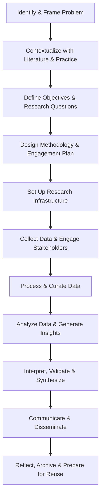
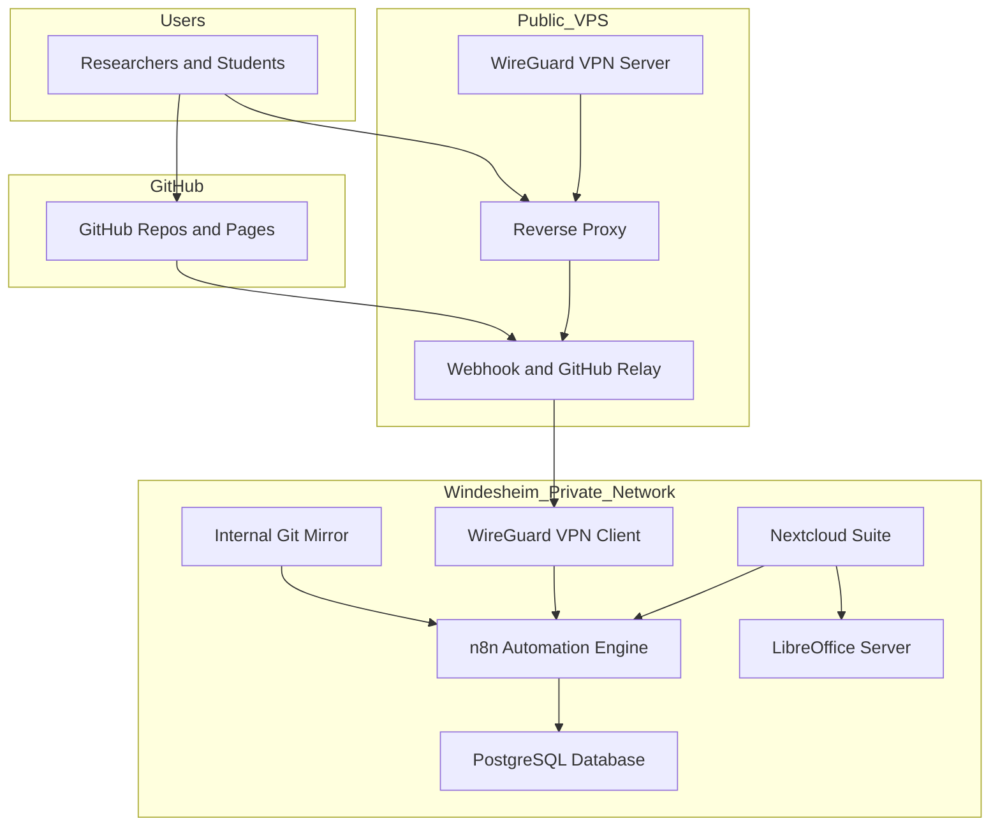
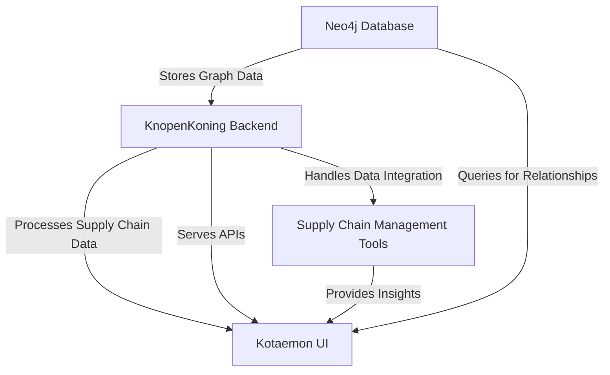
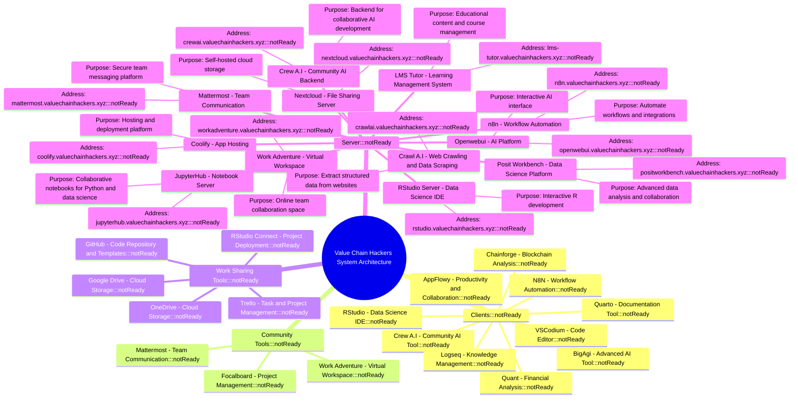

# VCH Lab – Practical Research Workflow from a Researcher's Perspective

## 1. Identify and Frame the Research Problem
- Observe a real-world issue or system breakdown
- Engage with stakeholders to understand needs and context
- Co-define the challenge with partners or beneficiaries
- Translate into a researchable problem statement
- Justify societal, economic, and environmental relevance

## 2. Contextualize with Literature and Practice
- Conduct a structured literature review
- Map relevant theories, legal frameworks, and policies (e.g. CSRD, EUDR)
- Analyze prior case studies or institutional reports
- Gather insights from practitioners, interviews, or workshops
- Identify conceptual gaps, contradictions, or innovations

## 3. Define Objectives and Research Questions
- Formulate guiding questions or hypotheses
- Define target outcomes (policy impact, practical tool, insight generation)
- Align research aims with stakeholder goals
- Establish success criteria and indicators

## 4. Design Methodology and Engagement Plan
- Choose suitable methods (surveys, interviews, modeling, desk research)
- Develop research instruments (guides, templates, frameworks)
- Co-create data collection protocols with field partners
- Define sampling logic and inclusion criteria
- Plan stakeholder check-ins and validation moments
- Prepare consent forms, ethical notes, and GDPR-safe workflows

## 5. Set Up Research Infrastructure
- Select tools for writing, collaboration, storage, and versioning
- Organize project folders, permissions, and document templates
- Configure data entry systems (Nextcloud forms, GitHub repos)
- Ensure reproducibility and traceability setup

## 6. Collect Data and Engage Stakeholders
- Conduct interviews, surveys, or workshops with field actors
- Log observational notes, transcripts, recordings
- Collect documents, reports, and digital sources
- Maintain communication with stakeholders throughout data collection
- Document engagement context and reflections

## 7. Process and Curate Data
- Clean and organize raw datasets
- Code qualitative transcripts
- Create summaries, fact sheets, or tagged excerpts
- Add metadata, version tags, and licensing info
- Store securely with backup and access protocols

## 8. Analyze Data and Generate Insights
- Conduct analysis (statistical, comparative, thematic, network)
- Use appropriate tooling (Excel, R, Python, qualitative coding tools)
- Involve stakeholders in interpreting preliminary results
- Explore alternative explanations or emerging patterns

## 9. Interpret, Validate, and Synthesize
- Link results back to theory, frameworks, and stakeholder needs
- Validate with advisory groups or co-researchers
- Draft conclusions, assumptions, and scenario options
- Co-reflect on meaning and future implications

## 10. Communicate and Disseminate
- Write reports, briefs, and recommendations
- Produce infographics, dashboards, or decision guides
- Present to partners, institutions, or conferences
- Publish findings on GitHub, institutional sites, or public channels
- Share back with all engaged actors (e.g. via Nextcloud or live session)

## 11. Reflect, Archive, and Prepare for Reuse
- Archive all data, documents, and versions clearly
- Document what worked and what didn’t (research diary, post-mortem)
- Identify questions for follow-up or continuation
- Ensure datasets and methods are licensed for future access
- Close the loop with stakeholders (e.g. feedback on implementation, impact)

Contraints: 

❗ Minimal to no budget

❗ Limited technical admin bandwidth

❗ Need for student usability (no long onboarding)

❗ Actual research demands (not just productivity tools)

✅ Desire for long-term scalability, documentation, and publishing

## 🅰️ Stack A – GitHub + Nextcloud Core

| **Research Step**                           | **Tool(s)**                                      |
|---------------------------------------------|--------------------------------------------------|
| 1. Identify & Frame Problem                 | Nextcloud Text, HedgeDoc                         |
| 2. Contextualize with Literature & Practice | Zotero, Nextcloud Files                          |
| 3. Define Objectives & Questions            | Nextcloud Text, GitHub Issues                    |
| 4. Design Methodology & Engagement Plan     | Nextcloud Office, Draw.io                        |
| 5. Set Up Research Infrastructure           | Nextcloud (self-hosted), GitHub, Docker Compose |
| 6. Collect Data & Engage Stakeholders       | Nextcloud Forms, KoboToolbox                     |
| 7. Process & Curate Data                    | LibreOffice, GitHub CSV                          |
| 8. Analyze Data & Generate Insights         | Jupyter (Colab), RStudio Cloud                   |
| 9. Interpret, Validate & Synthesize         | GitHub Discussions, Nextcloud Talk              |
|10. Communicate & Disseminate               | GitHub Pages, Nextcloud Deck                     |
|11. Reflect, Archive & Prepare for Reuse     | GitHub, Nextcloud Archive folders                |

## 🅱️ Stack B – GitHub Lite + Google Infra

| **Research Step**                           | **Tool(s)**                          |
|---------------------------------------------|--------------------------------------|
| 1. Identify & Frame Problem                 | Google Docs                          |
| 2. Contextualize with Literature & Practice | Zotero, Connected Papers             |
| 3. Define Objectives & Questions            | Google Docs, GitHub Issues           |
| 4. Design Methodology & Engagement Plan     | Google Slides, Draw.io               |
| 5. Set Up Research Infrastructure           | Google Drive, GitHub                 |
| 6. Collect Data & Engage Stakeholders       | Google Forms, KoboToolbox            |
| 7. Process & Curate Data                    | Google Sheets, GitHub CSV            |
| 8. Analyze Data & Generate Insights         | Google Colab, GitHub CSV workflows   |
| 9. Interpret, Validate & Synthesize         | Google Docs comments, Discord        |
|10. Communicate & Disseminate               | Canva (Free), Google Slides          |
|11. Reflect, Archive & Prepare for Reuse     | Google Drive, GitHub                 |

## 🅲 Stack C – Obsidian + GitHub + Local Tools

| **Research Step**                           | **Tool(s)**                             |
|---------------------------------------------|------------------------------------------|
| 1. Identify & Frame Problem                 | Obsidian Vault                          |
| 2. Contextualize with Literature & Practice | Zotero, Obsidian Citation Plugin        |
| 3. Define Objectives & Questions            | Obsidian + GitHub Issues                |
| 4. Design Methodology & Engagement Plan     | Obsidian Canvas, Markdown Templates     |
| 5. Set Up Research Infrastructure           | Local folders, GitHub                   |
| 6. Collect Data & Engage Stakeholders       | KoboToolbox (manual import)             |
| 7. Process & Curate Data                    | Local CSV, Obsidian Tables plugin       |
| 8. Analyze Data & Generate Insights         | R or Python, Obsidian Graph view        |
| 9. Interpret, Validate & Synthesize         | Obsidian links, GitHub PR reviews       |
|10. Communicate & Disseminate               | GitHub Pages, Markdown to PDF           |
|11. Reflect, Archive & Prepare for Reuse     | Obsidian Vaults, GitHub versioning      |

# Stack D – Visual Support (Canva-Centric)

| **Research Step**                         | **Tool**                                     |
|-------------------------------------------|----------------------------------------------|
| 1. Identify & Frame Problem               | Google Docs, Canva Templates                 |
| 2. Contextualize with Literature          | Canva Infographics, Google Scholar           |
| 3. Define Objectives & Questions          | Google Docs, Canva Storyboards               |
| 4. Design Methodology & Engagement Plan   | Google Slides, Canva                         |
| 5. Set Up Research Infrastructure         | Google Drive                                 |
| 6. Collect Data                           | Google Forms                                 |
| 7. Process & Curate Data                  | Google Sheets                                |
| 8. Analyze Data                           | Google Sheets Charts                         |
| 9. Interpret & Synthesize                 | Google Docs, Canva Visuals                   |
|10. Communicate & Disseminate             | Canva Presentations, PDF Export              |
|11. Reflect, Archive & Prepare for Reuse  | Google Drive Manual Versioning               |

# Stack E – Microsoft 365 Baseline

| **Research Step**                         | **Tool**                                     |
|-------------------------------------------|----------------------------------------------|
| 1. Identify & Frame Problem               | Microsoft Word, OneNote                      |
| 2. Contextualize with Literature          | Word References, Excel Tables                |
| 3. Define Objectives & Questions          | Word Templates, Outlook                      |
| 4. Design Methodology & Engagement Plan   | Word, PowerPoint                             |
| 5. Set Up Research Infrastructure         | OneDrive, Teams Planner                      |
| 6. Collect Data                           | Microsoft Forms                              |
| 7. Process & Curate Data                  | Excel, OneNote                               |
| 8. Analyze Data                           | Excel, Power BI Free                         |
| 9. Interpret & Synthesize                 | Teams, Word Comments                         |
|10. Communicate & Disseminate             | PowerPoint, PDF Export                       |
|11. Reflect, Archive & Prepare for Reuse  | OneDrive Versioning, SharePoint              |

# Tool Stack Comparison – Support Across the 11-Step Research Workflow

| **Research Step**                         | **GitHub + Nextcloud**         | **GitHub + Google**             | **Obsidian + GitHub**           | **Canva-Centric**               | **Microsoft 365**               |
|-------------------------------------------|--------------------------------|----------------------------------|----------------------------------|----------------------------------|----------------------------------|
| 1. Identify & Frame Problem               | ✅ (Text, Notes, HedgeDoc) 📈💸 | ✅ (Docs, Drive) 📈💸             | ✅ (Obsidian vault) 📈💸         | ⚠️ (Docs + Canva templates) 📈💸 | ✅ (Word + OneDrive) 📈          |
| 2. Contextualize with Literature          | ✅ (Zotero + Files) 📈💸        | ✅ (Zotero + Papers) 📈💸         | ✅ (Zotero + Obsidian) 📈💸      | ⚠️ (Infographics, not structured)📈💸 | ⚠️ (Word-based, no citation mgmt)📈 |
| 3. Define Objectives & Questions          | ✅ (Nextcloud Text + GitHub) 📈💸| ✅ (Docs + GitHub Issues) 📈💸   | ✅ (Markdown + GitHub) 📈💸      | ⚠️ (Docs, visual-only) 📈💸       | ✅ (Word templates) 📈            |
| 4. Design Methodology & Engagement Plan   | ✅ (Office + Diagrams) 📈💸     | ✅ (Slides, Draw.io) 📈💸         | ⚠️ (Manual in Markdown) 📈💸     | ✅ (Canva visuals) ⚠️🚫           | ✅ (PowerPoint + Word) 📈         |
| 5. Set Up Research Infrastructure         | ✅ (Docker + GitHub + Nextcloud)📈💸 | ⚠️ (Drive folders, no control) 🚫💸 | ✅ (Local + GitHub) 📈💸         | ⚠️ (Drive only, no real infra) 🚫💸 | ✅ (Teams + OneDrive) 🚫          |
| 6. Collect Data                           | ✅ (Forms + KoboToolbox) 📈💸   | ✅ (Forms + KoboToolbox) 🚫💸    | ⚠️ (Manual CSV import) 📈💸      | ⚠️ (Only via Forms) 🚫💸          | ✅ (MS Forms + Excel) 🚫          |
| 7. Process & Curate Data                  | ✅ (LibreOffice, CSV, GitHub) 📈💸 | ✅ (Sheets + GitHub) 🚫💸        | ⚠️ (Manual tagging in Obsidian) 📈💸 | ⚠️ (Basic Sheets) 🚫💸            | ✅ (Excel) 🚫                     |
| 8. Analyze Data                           | ✅ (Colab, RStudio) 📈💸        | ✅ (Colab, Sheets) 🚫💸           | ✅ (R/Python locally) 📈💸       | ⚠️ (Basic Sheets only) 🚫💸       | ⚠️ (Excel only, Power BI limited) 🚫 |
| 9. Interpret & Synthesize                 | ✅ (Talk + GitHub Discussions) 📈💸| ✅ (Discord + Docs) 🚫💸         | ⚠️ (Local links, GitHub PRs) 📈💸| ⚠️ (Docs, Canva) 🚫💸            | ✅ (Teams, Word) 🚫               |
|10. Communicate & Disseminate             | ✅ (GitHub Pages + Deck) 📈💸   | ✅ (Slides, Canva, Pages) 🚫💸    | ✅ (Markdown export + Pages) 📈💸| ✅ (Canva Presentations) 🚫💸     | ✅ (PowerPoint, PDF) 🚫           |
|11. Reflect, Archive & Prepare for Reuse  | ✅ (GitHub + Nextcloud) 📈💸    | ⚠️ (Drive lacks versioning) 🚫💸 | ✅ (Vault backups + GitHub) 📈💸 | 🚫 (Not designed for reproducibility) | ⚠️ (OneDrive with limits) 🚫     |

Legend:
✅ = Supports the research step well

⚠️ = Workable, but limited (e.g. no version control, requires manual steps)

🚫 = Legal/data sovereignty issue or major lock-in

📈 = Scales well to full lab use

💸 = Free to use without per-user cost

| **Tool**                 | **Free Tier Limitations**                                                    | **Scalability Warning**                                        |
| ------------------------ | ---------------------------------------------------------------------------- | -------------------------------------------------------------- |
| **Google Docs/Forms**    | Requires Google Accounts; storage and control tied to Google                 | Not GDPR-compliant for self-hosting or institutional ownership |
| **Microsoft Word/Forms** | Licensed through institution only; limited collaboration unless via OneDrive | Not usable freely outside Windesheim ecosystem                 |
| **Canva**                | Free version lacks brand kits, export options, team collaboration controls   | Easily hits limits in multi-user academic use                  |
| **Notion**               | 10 guests max, 1000 blocks for teams in free version                         | Needs upgrade fast once used collaboratively                   |
| **Miro**                 | Max 3 boards in free tier                                                    | Not viable for multiple teams/projects                         |
| **GitHub**               | ✅ Free for public and private repos (with 3GB storage)                       | ✅ Scales well, but not ideal for non-technical users           |
| **Nextcloud**            | ✅ Free and open-source; requires self-hosting                                | ✅ Can scale fully if hosted properly                           |
| **KoboToolbox**          | ✅ Free for non-commercial research                                           | ✅ Good for data collection in fieldwork contexts               |

* **Functionality fit**
* **Scalability**
* **Usability for students and researchers**
* **Maintenance effort**
* **Ethical/legal risks**

---

## 🅰️ Stack A — GitHub + Nextcloud

### ✅ Pros:

* Fully open and free with no per-user cost
* Supports **every step** of the research process from framing to archiving
* Nextcloud + GitHub provide **strong reproducibility, version control**, and **data ownership**
* Can be customized or expanded later with AI, dashboards, etc.
* Tools like HedgeDoc and Nextcloud Forms are **GDPR-safe** and team-friendly

### ❌ Cons:

* **High sysadmin burden**: requires self-hosting, updates, security
* UX can be **confusing to students** (Nextcloud Talk, GitHub Markdown issues, multiple logins)
* No built-in support or institution-backed onboarding
* Risk of infrastructure drift if key people (like Chris) leave

> 🧠 Best suited for: **Long-term academic labs** with stable hosting and technical capacity.

---

## 🅱️ Stack B — GitHub + Google

### ✅ Pros:

* **Extremely easy onboarding** for students — nearly everyone has a Google account
* Tools like Google Docs, Forms, Sheets, and Colab **cover most steps effortlessly**
* GitHub can handle versioning, collaboration, and publishing even if Google fails
* Practically **zero maintenance overhead**

### ❌ Cons:

* 🚫 **No real data ownership**: Google holds the keys. GDPR non-compliant for sensitive projects
* Google Drive is **not reproducible or archive-ready**
* Free tier may be shut down or restricted without notice
* Multiple environments can cause **workflow fragmentation**

> 🧠 Best suited for: **Fast-paced student projects or workshops**, not long-term reproducible research.

---

## 🅾️ Stack C — Obsidian + GitHub + Local Tools

### ✅ Pros:

* Ideal for **deep individual research**: personal knowledge graphs, strong metadata, citation support
* Obsidian supports **Zettelkasten**, linking, versioning, and publishing via GitHub
* Fully local, no cloud lock-in, 100% reproducible
* Great for researchers, PhD candidates, or faculty working on theory or synthesis

### ❌ Cons:

* ❌ Not designed for teamwork — no real-time collaboration or document sharing
* Requires **Git and markdown literacy**
* Difficult for students to adopt without significant onboarding
* No form or survey infrastructure; everything is **manual import**

> 🧠 Best suited for: **Research experts or solo knowledge workers**, not classroom or student teams.

---

## 🅳 Stack D — Canva-Centric

### ✅ Pros:

* ✅ Very easy to use — great for design, storytelling, and stakeholder presentations
* Works well for creating outputs (posters, reports, slides)
* Canva + Google Sheets cover basic workflow steps
* Students are **already familiar** with these tools

### ❌ Cons:

* 🚫 Not a research stack. No real versioning, reproducibility, or traceability
* Canva free tier has **heavy limitations**: exports, folders, brand kits
* Google Sheets can’t handle large or structured datasets
* Lacks infrastructure, no data governance, no archiving

> 🧠 Best suited for: **Communication and visual storytelling**, not for conducting or storing research.

---

## 🅴 Stack E — Microsoft 365 (Teams, Word, Excel)

### ✅ Pros:

* Fully integrated ecosystem — files, meetings, forms, and Excel all connected
* **Institutionally supported by Windesheim** — licenses, support, security
* Easy for students and faculty to adopt without setup time
* MS Forms + Excel are **good enough** for basic data collection and analysis

### ❌ Cons:

* 🚫 Closed ecosystem with no access to raw infrastructure
* Not ideal for **open science** or reproducibility (e.g., no markdown, no Git, no public publishing)
* Teams and SharePoint are **heavy**, unintuitive, and often underused
* Integration with GitHub or open tools is awkward

> 🧠 Best suited for: **Administrative research or institutional assignments**, not open or exploratory labs.

---

## 🔍 Summary of Arguments

| **Stack**          | **Best For**                                | **Why You Should Doubt It**                                               |
| ------------------ | ------------------------------------------- | ------------------------------------------------------------------------- |
| GitHub + Nextcloud | Sustainable open research infrastructure    | High maintenance burden, non-intuitive UX                                 |
| GitHub + Google    | Student-driven projects & onboarding speed  | No control over data, long-term fragility, legal gray zone                |
| Obsidian + GitHub  | Solo researchers doing structured knowledge | Not team-ready, requires Git/Markdown fluency                             |
| Canva-Centric      | Communication, visuals, stakeholder outputs | Not reproducible, no data ownership, limited depth, not frre              |
| Microsoft 365      | Compliance and institution-first workflows  | Not compatible with open science, public sharing, or transparent research |

---

| **Aspect / Criterion**         | **MS Office**                               | **Nextcloud + GitHub**                           | **MS Office + Obsidian + GitHub**                | **MS Office + Discord + GitHub**                     |
|-------------------------------|---------------------------------------------|--------------------------------------------------|--------------------------------------------------|------------------------------------------------------|
| **Communication**             | Outlook or Teams (closed, async/sync)       | Nextcloud Talk (limited, open, rarely used)      | No built-in tool (email only)                    | Discord (closed, real-time chat/voice/video)         |
| **Collaboration**             | Word/Excel (some real-time co-editing)      | Nextcloud Office (real-time co-editing, open)    | Obsidian (local), GitHub (no real-time editing)  | Word/Excel (shared), GitHub (version control)        |
| **Progress/result sharing**   | Email or OneDrive shared docs               | Nextcloud wikis, GitHub Pages/Wikis              | Obsidian vaults (local), GitHub commits          | GitHub Issues, Office files, Discord threads         |
| **Monthly cost**              | Covered by Windesheim license               | ~€200/month (self-hosted infra, no support)      | Free (but user-managed)                          | Free (using existing licenses + public tools)        |
| **Ease of use**               | ✅ Very high (students familiar)             | ⚠️ Moderate (depends on setup, some onboarding)   | ❌ Low (markdown/GitHub knowledge required)       | ⚠️ Medium (easy chat, harder file management)        |
| **Scalability**               | ⚠️ Limited by MS licensing                  | 📈 High (if well-hosted)                          | ⚠️ Medium (manual syncing, no central control)    | 📈 Medium–High (tools scale, but coordination needed) |
| **Integration ability**       | ⚠️ Moderate (closed ecosystem)              | ✅ High (GitHub workflows, plugins)               | ✅ Moderate–High (GitHub + markdown)              | ⚠️ Moderate (via Discord bots, GitHub actions)       |
| **Privacy / Data Control**    | 🚫 Low (hosted by Microsoft)                | ✅ High (self-hosted, open stack)                 | ⚠️ Medium (local control, GitHub cloud risk)      | 🚫 Low (Discord, GitHub = external cloud)            |
| **Maintenance**               | ✅ Low (managed by Windesheim IT)            | ❌ High (requires admin, updates, security)       | ✅ Low (self-managed local setup)                 | ✅ Low (hosted externally, minimal overhead)          |
| **Who hosts it**              | Windesheim                                   | Chris / Internal Admin                            | Individual user                                   | Windesheim (Office), others are external platforms   |

# VCH Tool Stack Comparison – Reality-Checked with 11 Research Steps

| **Research Step**                          | **MS Office**               | **Nextcloud + GitHub**         | **MS Office + Obsidian + GitHub** | **MS Office + Discord + GitHub**  |
|-------------------------------------------|------------------------------|----------------------------------|-------------------------------------|-------------------------------------|
| 1. Identify & Frame Problem               | ✅ Word, email, Teams         | ⚠️ Text tools exist, but unstructured | ✅ Obsidian vaults, GitHub Issues   | ✅ Discord discussion + notes       |
| 2. Contextualize with Literature          | ⚠️ Word ref manager (limited) | ✅ Zotero + Nextcloud Files      | ✅ Obsidian + Zotero plugin         | ⚠️ Depends on external tools        |
| 3. Define Objectives & Questions          | ✅ Word templates              | ✅ GitHub Issues + Markdown      | ✅ GitHub markdown + structured notes | ✅ Discord for collab, GitHub for tracking |
| 4. Design Methodology & Engagement Plan   | ✅ Word + PPT                  | ✅ GitHub Wiki + Nextcloud Docs  | ⚠️ Markdown only, hard to visualize | ✅ PPT + Discord discussions        |
| 5. Set Up Research Infrastructure         | ❌ No infra tools             | ✅ GitHub + Nextcloud (requires admin) | ⚠️ Manual GitHub sync, local        | ⚠️ No infra control, fragmented     |
| 6. Collect Data                           | ✅ MS Forms                   | ✅ Nextcloud Forms, KoboToolbox | ❌ Manual input only                | ✅ MS Forms or Google Forms         |
| 7. Process & Curate Data                  | ✅ Excel                      | ✅ LibreOffice + GitHub versioning | ⚠️ Manual CSV + Markdown            | ✅ Excel + GitHub repo              |
| 8. Analyze Data                           | ⚠️ Excel only                 | ✅ Jupyter via Colab, RStudio    | ✅ Python or R locally              | ⚠️ Only with external tools         |
| 9. Interpret & Synthesize                 | ⚠️ Word + Outlook comments    | ✅ GitHub Discussions + Docs     | ✅ Obsidian linking                 | ✅ Discord calls + GitHub Issues    |
|10. Communicate & Disseminate             | ✅ PPT, Word reports          | ✅ GitHub Pages, Nextcloud Deck | ✅ GitHub Pages, Obsidian PDF       | ✅ Canva, Discord posts, GitHub     |
|11. Reflect, Archive & Prepare for Reuse  | ⚠️ OneDrive (weak VC, closed) | ✅ GitHub + Nextcloud backups    | ✅ GitHub repo, vault backups       | ⚠️ GitHub is fine, Discord is ephemeral |

VCH-Infra

| Subdomain                                                      | Tool/Service       | Description                                                                 |
|----------------------------------------------------------------|--------------------|-----------------------------------------------------------------------------|
| [https://n8n1.ixworx.nl](https://n8n1.ixworx.nl)               | n8n                | Automate workflows and integrate APIs or apps without code.                |
| [https://openwebui1.ixworx.nl](https://openwebui1.ixworx.nl)   | Open WebUI         | Chat interface for running and managing local LLMs.                        |
| [https://flowise1.ixworx.nl](https://flowise1.ixworx.nl)       | Flowise            | Visual editor for building and deploying LLM pipelines and agents.         |
| [https://langfuse1.ixworx.nl](https://langfuse1.ixworx.nl)     | Langfuse           | Monitor, evaluate, and debug LLM-based applications.                       |
| [https://ollama1.ixworx.nl](https://ollama1.ixworx.nl)         | Ollama             | Run and manage LLMs like LLaMA, Mistral, etc., locally with GPU support.   |
| [https://supabase1.ixworx.nl](https://supabase1.ixworx.nl)     | Supabase           | Backend as a service: Postgres, authentication, storage, and APIs.        |
| [https://searxng1.ixworx.nl](https://searxng1.ixworx.nl)       | SearxNG            | Privacy-respecting metasearch engine aggregating multiple sources.         |
| [https://supabasestudio1.ixworx.nl](https://supabasestudio1.ixworx.nl) | Supabase Studio    | Web-based admin panel for managing Supabase services and databases.        |

## 👓 Recommended reading

n8n is full of useful content for getting started quickly with its AI concepts
and nodes. If you run into an issue, go to [support](#support).

- [AI agents for developers: from theory to practice with n8n](https://blog.n8n.io/ai-agents/)
- [Tutorial: Build an AI workflow in n8n](https://docs.n8n.io/advanced-ai/intro-tutorial/)
- [Langchain Concepts in n8n](https://docs.n8n.io/advanced-ai/langchain/langchain-n8n/)
- [Demonstration of key differences between agents and chains](https://docs.n8n.io/advanced-ai/examples/agent-chain-comparison/)
- [What are vector databases?](https://docs.n8n.io/advanced-ai/examples/understand-vector-databases/)

## 🎥 Video walkthrough

- [Cole's Guide to the Local AI Starter Kit](https://youtu.be/pOsO40HSbOo)

## 🛍️ More AI templates

For more AI workflow ideas, visit the [**official n8n AI template
gallery**](https://n8n.io/workflows/?categories=AI). From each workflow,
select the **Use workflow** button to automatically import the workflow into
your local n8n instance.

### Learn AI key concepts

- [AI Agent Chat](https://n8n.io/workflows/1954-ai-agent-chat/)
- [AI chat with any data source (using the n8n workflow too)](https://n8n.io/workflows/2026-ai-chat-with-any-data-source-using-the-n8n-workflow-tool/)
- [Chat with OpenAI Assistant (by adding a memory)](https://n8n.io/workflows/2098-chat-with-openai-assistant-by-adding-a-memory/)
- [Use an open-source LLM (via HuggingFace)](https://n8n.io/workflows/1980-use-an-open-source-llm-via-huggingface/)
- [Chat with PDF docs using AI (quoting sources)](https://n8n.io/workflows/2165-chat-with-pdf-docs-using-ai-quoting-sources/)
- [AI agent that can scrape webpages](https://n8n.io/workflows/2006-ai-agent-that-can-scrape-webpages/)

## What Is It?

**VCH-Infra** is a fully integrated, open-source research ecosystem designed to streamline supply chain finance innovation. It’s a modular infrastructure that empowers academics, researchers, and students to collaborate, analyze, and solve complex problems more efficiently than ever before.

---

## How Does It Work?

1. **Centralized Tools**: 
   - From data science platforms like RStudio and JupyterHub to workflow automation with n8n, every tool is pre-configured and accessible through a unified interface.
   - Integrated with Traefik for seamless subdomain routing, making deployment and access frictionless.

2. **Tailored for Research**: 
   - Specialized tools like Neo4j for graph data, Kotaemon for assessments, and Openwebui for AI applications provide unparalleled capabilities for research in supply chain finance.

3. **Collaboration at Its Core**: 
   - Mattermost, Nextcloud, and Work Adventure ensure real-time communication and secure file sharing, fostering teamwork and innovation.

4. **Data-Driven Insights**:
   - Tools like Prometheus and Grafana monitor performance and metrics, while Quant and Streamlit provide advanced analytical and visualization capabilities.

---

## Are You Sure?

### Proof of Concept:

- **Built for Your Needs**: Designed specifically for academic and applied research workflows.
- **Proven Tools**: All components are tested, widely adopted open-source solutions trusted by leading organizations globally.
- **Scalable and Sustainable**: Hosted on a robust server infrastructure (IP: 148.251.4.42) with Dockerized services for easy scaling.

---

## What's in It for You?

1. **Streamlined Research**:
   - No more time lost on fragmented setups or incompatible tools—VCH-Infra ensures everything works together seamlessly.
   
2. **Cost Efficiency**:
   - Entirely open-source, eliminating licensing fees and reducing long-term IT expenses.

3. **Real-World Impact**:
   - Enables cutting-edge research in supply chain finance, directly contributing to industry advancements.

4. **Educational Excellence**:
   - Empowers students and researchers with industry-grade tools, fostering a culture of innovation and collaboration.

---

## Real-World Examples

1. **Brightlands Institute for Supply Chain Innovation (BISCI)**:
   - **Location**: Maastricht University, Netherlands.
   - **Overview**: BISCI develops smart and sustainable innovations in supply chain management by applying the latest research to address challenges faced by service providers.
   - **Source**: [Maastricht University - BISCI](https://www.maastrichtuniversity.nl/research/brightlands-institute-supply-chain-innovation)

2. **Supply Chain Finance Barometer**:
   - **Conducted by**: PwC and the Supply Chain Finance Community.
   - **Findings**: Provides insights into the current position, development, and successes of supply chain finance, highlighting main drivers, success factors, and bottlenecks of SCF programs.
   - **Source**: [PwC Supply Chain Finance Barometer](https://www.pwc.nl/en/publicaties/supply-chain-finance-barometer.html)

3. **European Open Science Cloud (EOSC)**:
   - **Initiative**: European Commission.
   - **Purpose**: Develops an infrastructure providing users with services promoting open science practices, aggregating services from various providers following a system of systems approach.
   - **Source**: [European Open Science Cloud - Wikipedia](https://en.wikipedia.org/wiki/European_Open_Science_Cloud)

4. Quarto Examples: @ For Valuechain hackers:
    
    - https://value-chain-hackers.github.io/vch-website/
    - https://kde.org/for/scientists/

## **Problem Definition**

### **Problem Statement:**
Many academic and research organizations, especially in supply chain finance, face significant challenges in integrating the right tools for data analysis, workflow automation, team collaboration, and AI-based experimentation. The lack of an integrated, open-source ecosystem leads to inefficiencies, increased setup times, higher costs, and difficulties in maintaining and scaling research infrastructures.

### **Specific Challenges:**
1. **Fragmented Toolsets**:
   - Academic institutions often rely on disparate tools for various functions (e.g., JupyterHub for notebooks, Neo4j for graph databases, n8n for automation). Integrating them manually leads to inefficiencies, inconsistent user experiences, and compatibility issues.
  
2. **High Licensing Costs**:
   - Many premium tools (e.g., MATLAB, Tableau) come with substantial licensing fees that strain research budgets, especially in institutions with limited funding for software.

3. **Collaboration and Communication**:
   - Research teams, especially in collaborative academic environments, struggle with real-time communication, project management, and data sharing due to lack of cohesive infrastructure and tools.

4. **Scalability and Sustainability**:
   - Existing research infrastructures often lack flexibility for scaling, with many legacy tools failing to provide automated updates or easy scaling options as research demands grow.

### **Goal of VCH-Infra**:
The goal is to provide an integrated, open-source ecosystem that streamlines collaboration, reduces setup times, minimizes licensing costs, and empowers students and researchers to tackle complex supply chain finance problems more efficiently.

---

## **Risk Analysis**

### **Risk Categories**

1. **Technological Risks:**
   - **Compatibility Issues**: Integrating diverse open-source tools can result in compatibility challenges, especially when updating or maintaining tools.
     - *Mitigation*: Ensure that all tools are Dockerized and tested for compatibility. Use container orchestration tools like Docker Compose to simplify integration.
  
   - **Performance and Scalability**: As the ecosystem grows with more users, there may be performance bottlenecks (e.g., server overload, slow response times).
     - *Mitigation*: Regularly monitor performance using Prometheus and Grafana to track server health, and scale infrastructure as needed (e.g., load balancing, additional server resources).

2. **Financial Risks:**
   - **Budget Overruns**: Open-source tools are free, but setting up and maintaining a server infrastructure (e.g., hosting costs, data storage, backups) could lead to unplanned expenses.
     - *Mitigation*: Plan budgets around open-source infrastructure, focusing on cost-effective tools (e.g., utilizing Nextcloud for file sharing and backups, which are more affordable than proprietary alternatives).

   - **Lack of Funding for Scaling**: Research institutions may face budget cuts or limited funding for expanding the ecosystem as the user base grows.
     - *Mitigation*: Build the infrastructure with scalability in mind, leveraging cloud services with cost-efficiency and applying for open-source project grants or partnerships.

3. **Operational Risks:**
   - **Complexity in Training**: Users might struggle with complex tools, especially when the setup is unfamiliar, leading to slow adoption and possible misuse.
     - *Mitigation*: Provide comprehensive training materials, detailed documentation, and community support. Encourage peer-to-peer learning and develop easy-to-follow tutorials for common tasks.

   - **Dependence on Open-Source Communities**: The long-term viability of the project depends on the continued development of open-source tools, which could become unsupported or abandoned.
     - *Mitigation*: Regularly assess and update the ecosystem, contributing to the communities behind the tools to ensure their continued development and support.

4. **Security and Data Privacy Risks:**
   - **Data Security**: Storing sensitive research data in an open-source infrastructure could expose vulnerabilities to data breaches or unauthorized access.
     - *Mitigation*: Implement strong encryption (e.g., using BorgBackup for secure backups), use access control policies for Nextcloud, and regularly audit systems for vulnerabilities.

   - **Compliance with Regulations**: Managing data in compliance with GDPR or other local laws (especially in academic settings) can be challenging.
     - *Mitigation*: Ensure that all tools, especially file-sharing and storage tools like Nextcloud, adhere to GDPR and data protection regulations. Implement strict access controls and audit trails.

5. **Adoption and Stakeholder Risks:**
   - **Resistance to Change**: Researchers and students may be hesitant to adopt a new infrastructure, preferring traditional, familiar tools.
     - *Mitigation*: Foster engagement by showcasing successful case studies, offering hands-on demonstrations, and encouraging feedback to improve the user experience.

   - **Lack of Collaboration**: Without proper adoption across academic departments, the ecosystem might fail to deliver its full potential in promoting collaboration.
     - *Mitigation*: Create incentives for early adopters, offer collaboration-specific features in tools like Mattermost and Work Adventure, and involve department heads in the planning and rollout process.

---

### **Core Tools**

| **Tool**       | **Primary Role**                             | **Essential Problems from Text It Mitigates**                                                                                                                           | **Why It's Critical in VCH-Infra**                                                                                                    |
|----------------|----------------------------------------------|----------------------------------------------------------------------------------------------------------------------------------------------------------------------------------------------------------------|-----------------------------------------------------------------------------------------------------------------------------------------------------------------------------|
| **Forgejo**    | Git repository hosting & collaboration       | **Fragmented Toolsets**: Centralizes code in an open-source environment, reducing reliance on multiple, disconnected platforms  **High Licensing Costs**: Eliminates expensive per-seat licensing for Git hosting | Provides a self-hosted, cost-effective code collaboration platform, ensuring researchers and developers share and version control effectively                               |
| **OneDev.io**  | CI/CD pipeline automation                    | **Fragmented Toolsets**: Unifies build, test, and deploy processes in one place  **High Licensing Costs**: Replaces proprietary CI/CD services with a free, open-source alternative                       | Streamlines software delivery, enabling faster iteration and consistent deployment workflows across all research and development projects                                  |
| **Mattermost** | Real-time team communication & collaboration |  **Collaboration & Communication**: Centralizes chat and discussion, eliminating email overload or fragmented messaging - **Scalability & Sustainability**: Easy to add new channels/users as the research team grows | Fosters real-time interactions and knowledge sharing, ensuring rapid feedback loops and more cohesive teamwork, crucial in fast-paced research environments               |
| **Nextcloud**  | Secure file sharing & collaboration           |  **Fragmented Toolsets**: Consolidates all file sharing, reducing reliance on multiple external cloud storage solutions  **High Licensing Costs**: Fully open-source, avoiding recurring SaaS fees           | Offers a private, compliant, and integrated solution for file versioning, data sharing, and document collaboration, critical for research-intensive startups                |
| **JupyterHub** | Data science & prototyping environment        | **Fragmented Toolsets**: Centralizes Python/R notebooks for collaborative data analysis  **Scalability & Sustainability**: Containerized deployment scales to multiple users without complex overhead         | Provides a shared analytical workspace where researchers can prototype, run experiments, and share results instantly, vital for data-driven innovation in supply chain finance |
               |

---

## Call to Action

Imagine a research environment where every tool you need is at your fingertips, every project runs seamlessly, and collaboration drives success. **That’s VCH-Infra.**

Let us help you lead the charge in supply chain finance innovation. Ready to see it in action? Let’s set up a live demo and take the first step toward transforming your research capabilities.

here is an overview

Server IP: 148.251.4.42

# Integrated Ecosystem Overview

| **Service Name**       | **Purpose**                              | **Key Role in Ecosystem**                                      | **Works Together With**                                            |
|------------------------|------------------------------------------|----------------------------------------------------------------|---------------------------------------------------------------------|
| **Dokku**              | App hosting platform                     | Hosts applications with Docker; manages deployments easily.    | Traefik, OneDev.io, Docker                                          |
| **OneDev.io**          | CI/CD pipeline automation                | Automates builds, tests, and deployments for applications.     | Forgejo, Dokku, Traefik                                             |
| **Forgejo**            | Git repository management                | Manages source code, configurations, and Dockerfiles.          | OneDev.io, Dokku                                                    |
| **Prometheus**         | Monitoring system                        | Collects metrics for applications and servers.                 | Grafana, Traefik, Dokku                                             |
| **Grafana**            | Visualization and analytics platform     | Creates dashboards to visualize metrics and logs.              | Prometheus, Neo4j, Elasticsearch                                    |
| **Traefik**            | Reverse proxy                            | Routes traffic to subdomains for hosted services.              | Dokku, Prometheus, Grafana, HTTP Debugger                           |
| **Nextcloud**          | File sharing and collaboration           | Provides secure, versioned file sharing and backups.           | Grafana, BorgBackup, Redis                                          |
| **BorgBackup**         | Backup and recovery tool                 | Ensures encrypted, deduplicated backups of critical data.      | Nextcloud, Dokku                                                    |
| **JupyterHub**         | Notebook server                          | Facilitates collaborative coding and data analysis.            | RStudio Server, Pipelines, Streamlit, Neo4j, Qdrant                 |
| **RStudio Server**     | Data science IDE                         | Offers tools for statistical computing and visualization.      | JupyterHub, Forgejo, OneDev.io, Geospatial                          |
| **n8n**                | Workflow automation                      | Automates repetitive tasks and integrates tools.               | Dokku, Prometheus                                                   |
| **Mattermost**         | Team communication                       | Provides secure real-time collaboration for teams.             | Nextcloud, Work Adventure                                          |
| **Work Adventure**     | Virtual workspace                        | Facilitates virtual meetings and immersive collaboration.      | Mattermost, Nextcloud                                              |
| **Openwebui**          | AI platform                              | Hosts AI models for inference tasks (CUDA-enabled).            | Crew A.I, Ollama, Qdrant                                            |
| **Neo4j**              | Graph database                           | Enables graph-based data modeling and queries.                 | Grafana, Prometheus, JupyterHub                                     |
| **Crawl A.I**          | Web crawling and data scraping           | Collects large-scale research data from the web.               | Dokku, Grafana                                                      |
| **Crew A.I**           | Collaboration of AI agents               | Manages/integrates multi-agent workflows.                      | Openwebui, JupyterHub, Flowise                                      |
| **LMS Tutor**          | Learning management system               | Hosts course materials and assessments for students.           | Nextcloud, Kotaemon                                                |
| **Kotaemon**           | Assessment and evaluation system         | Enables document-based evaluations and assessments.            | LMS Tutor, JupyterHub                                              |
| **Dash**               | Interactive dashboards for data apps     | Builds web-based analytical applications.                      | JupyterHub, RStudio Server                                          |
| **Streamlit**          | Rapid creation of data apps              | Develops interactive dashboards and tools for insights.        | JupyterHub, RStudio Server                                          |
| **Flowise**            | Open-source LangChain UI                 | Simplifies building/deploying conversational AI models.        | Openwebui, Crew A.I, JupyterHub                                     |
| **Elasticsearch**      | Search and analytics engine              | Stores and queries logs/unstructured data.                     | Grafana, Prometheus, Qdrant                                         |
| **Geospatial**         | Specialized R environment for mapping    | Advanced geospatial analysis and visualization.                | RStudio Server, JupyterHub, Nextcloud                               |
| **HTTP Debugger**      | Basic HTTP request/response tester       | Inspects request headers, bodies, and status codes.            | Traefik, Docker containers needing request debug                    |
| **Ollama**             | Local LLM inference engine               | Provides offline language model inference.                     | Openwebui, Open4all, Qdrant, JupyterHub                             |
| **open4all**           | Secondary AI platform (Openwebui-based)  | Runs AI tasks with custom environment or GPU support.          | Openwebui, Qdrant, Ollama, JupyterHub                               |
| **Pipelines**          | AI data processing pipeline manager      | Orchestrates embedding, summarization, or other AI workflows.  | JupyterHub, Openwebui, Qdrant, Ollama                               |
| **Qdrant**             | Vector database                          | Stores embeddings for semantic or similarity searches.         | Openwebui, pipelines, Ollama, JupyterHub, Elasticsearch             |
| **Redis**              | In-memory data store and cache           | Speeds up data retrieval and session management.               | Nextcloud, JupyterHub, Mattermost                                   |
| **SearxNG**            | Privacy-respecting meta search engine    | Aggregates multiple search engines for user or AI queries.     | Openwebui, Open4all, Nextcloud, JupyterHub                          |

## Software Status table
| **Software Name**        | **Address**                                                            | **GitHub Repository**                                                | **Status**       | **Configuration Specifics**                                                                                      |
|--------------------------|------------------------------------------------------------------------|-----------------------------------------------------------------------|------------------|-------------------------------------------------------------------------------------------------------------------|
| **Traefik**              | [traefik.valuechainhackers.xyz](https://traefik.valuechainhackers.xyz) | [Traefik GitHub](https://github.com/traefik/traefik)                 | Ready            | Reverse proxy configured via Docker Compose & `traefik.toml`; uses Let’s Encrypt for TLS certificates.            |
| **HTTP Debugger**        | [http.valuechainhackers.xyz](https://http.valuechainhackers.xyz)       | [HTTP Debugger GitHub](https://github.com/czerasz/docker-http-debugger) | Ready         | Simple debugging container in Compose (HTTP→HTTPS via Traefik).                                                   |
| **Ollama**               | [ollama.valuechainhackers.xyz](https://ollama.valuechainhackers.xyz)   | [Ollama GitHub](https://github.com/jmorganca/ollama)                  | Ready            | Docker Compose with GPU reservations (if available); served by Traefik on port 11434.                             |
| **Open4all**             | [open4all.valuechainhackers.xyz](https://open4all.valuechainhackers.xyz) | [OpenWebUI GitHub](https://github.com/open-webui/open-webui)         | Ready            | Second instance of OpenWebUI-based image with custom environment; GPU-enabled and behind Traefik.                 |
| **Geospatial (Rocker)**  | [geospatial.valuechainhackers.xyz](https://geospatial.valuechainhackers.xyz) | [Rocker Geospatial GitHub](https://github.com/rocker-org/geospatial) | Ready            | RStudio-based geospatial environment via Docker Compose; served on port 8787 with TLS from Traefik.               |
| **Pipelines**            | [pipelines.valuechainhackers.xyz](https://pipelines.valuechainhackers.xyz) | [OpenWebUI Pipelines GitHub](https://github.com/open-webui/pipelines)| Ready            | Docker Compose service at port 9099 with Traefik HTTP→HTTPS routing.                                              |
| **Qdrant**               | [qdrant.valuechainhackers.xyz](https://qdrant.valuechainhackers.xyz)   | [Qdrant GitHub](https://github.com/qdrant/qdrant)                    | Ready            | Vector database in Docker Compose; port 6333 exposed behind Traefik.                                              |
| **SearXNG**              | [searxng.valuechainhackers.xyz](https://searxng.valuechainhackers.xyz) | [SearXNG GitHub](https://github.com/searxng/searxng)                 | Ready            | Self-hosted meta-search engine in Docker Compose, served on port 8080 behind Traefik.                             |
| **Redis**                | *Internal / TCP on :6379*                                              | [Redis GitHub](https://github.com/redis/redis)                       | Ready            | Docker Compose with `requirepass`; optionally exposed via Traefik TCP router for SSL termination if configured.   |
| **Elasticsearch**        | [elasticsearch.valuechainhackers.xyz](https://elasticsearch.valuechainhackers.xyz) | [Elasticsearch GitHub](https://github.com/elastic/elasticsearch) | Ready            | Single-node ES in Docker Compose with limited Java heap, port 9200 behind Traefik.                                |
| **Dokku**                | [dokku.valuechainhackers.xyz](https://dokku.valuechainhackers.xyz)     | [Dokku GitHub](https://github.com/dokku/dokku)                       | Not Ready        |                                                                                                                   |
| **OneDev.io**            | [onedev.valuechainhackers.xyz](https://onedev.valuechainhackers.xyz)   | [OneDev GitHub](https://github.com/theonedev/onedev)                 | Not Ready        |                                                                                                                   |
| **Forgejo**              | [forgejo.valuechainhackers.xyz](https://forgejo.valuechainhackers.xyz) | [Forgejo GitHub](https://github.com/forgejo/forgejo)                 | Not Ready        |                                                                                                                   |
| **Prometheus**           | [prometheus.valuechainhackers.xyz](https://prometheus.valuechainhackers.xyz) | [Prometheus GitHub](https://github.com/prometheus/prometheus)      | Not Ready        |                                                                                                                   |
| **Grafana**              | [grafana.valuechainhackers.xyz](https://grafana.valuechainhackers.xyz) | [Grafana GitHub](https://github.com/grafana/grafana)                 | Ready            | Docker Compose with persistent volume & Traefik.                                                                 |
| **Nextcloud**            | [nextcloud.valuechainhackers.xyz](https://nextcloud.valuechainhackers.xyz) | [Nextcloud GitHub](https://github.com/nextcloud/server)            | Not Ready        |                                                                                                                   |
| **BorgBackup**           | *Not Hosted*                                                           | [BorgBackup GitHub](https://github.com/borgbackup/borg)             | Not Ready        |                                                                                                                   |
| **JupyterHub**           | [jupyterhub.valuechainhackers.xyz](https://jupyterhub.valuechainhackers.xyz) | [JupyterHub GitHub](https://github.com/jupyterhub/jupyterhub)     | Ready            | Docker Compose with Git + user provisioning; served via Traefik at port 8000.                                     |
| **RStudio Server**       | [rstudio.valuechainhackers.xyz](https://rstudio.valuechainhackers.xyz) | [RStudio GitHub](https://github.com/rstudio/rstudio)                | Ready            | Docker Compose with port 8787, secured behind Traefik.                                                            |
| **n8n**                  | [n8n.valuechainhackers.xyz](https://n8n.valuechainhackers.xyz)         | [n8n GitHub](https://github.com/n8n-io/n8n)                          | Ready            | Docker Compose with Basic Auth + HTTPS via Traefik.                                                               |
| **Mattermost**           | [mattermost.valuechainhackers.xyz](https://mattermost.valuechainhackers.xyz) | [Mattermost GitHub](https://github.com/mattermost/mattermost-server)| Not Ready        |                                                                                                                   |
| **Work Adventure**       | [workadventure.valuechainhackers.xyz](https://workadventure.valuechainhackers.xyz) | [Work Adventure GitHub](https://github.com/thecodingmachine/workadventure) | Not Ready  |                                                                                                                   |
| **Openwebui**            | [openwebui.valuechainhackers.xyz](https://openwebui.valuechainhackers.xyz) | [OpenWebUI GitHub](https://github.com/open-webui/open-webui)        | Ready            | CUDA version in Docker Compose with GPU reservation; behind Traefik.                                             |
| **Neo4j**                | [neo4j.valuechainhackers.xyz](https://neo4j.valuechainhackers.xyz)     | [Neo4j GitHub](https://github.com/neo4j/neo4j)                       | Ready            | Docker Compose behind Traefik, ports 7474 (HTTP) & 7687 (Bolt).                                                  |
| **Crawl A.I**            | [crawlai.valuechainhackers.xyz](https://crawlai.valuechainhackers.xyz) | [Crawl A.I GitHub](https://github.com/unclecode/crawl4ai)           | Not Ready        |                                                                                                                   |
| **Crew A.I**             | [crewai.valuechainhackers.xyz](https://crewai.valuechainhackers.xyz)   | [Crew A.I GitHub](https://github.com/crewAIInc/crewAI-examples)      | Not Ready        |                                                                                                                   |
| **LMS Tutor**            | [lms-tutor.valuechainhackers.xyz](https://lms-tutor.valuechainhackers.xyz) | [Tutor GitHub](https://github.com/overhangio/tutor)                | Not Ready        |                                                                                                                   |
| **Kotaemon**             | [kotaemon.valuechainhackers.xyz](https://kotaemon.valuechainhackers.xyz) | [Kotaemon GitHub](https://github.com/Cinnamon/kotaemon)             | Ready            | Docker Compose (CUDA) with GPU reservations, behind Traefik.                                                      |
| **Dash**                 | *Not Hosted*                                                           | [Dash GitHub](https://github.com/plotly/dash)                        | Not Ready        |                                                                                                                   |
| **Streamlit**            | *Not Hosted*                                                           | [Streamlit GitHub](https://github.com/streamlit/streamlit)          | Not Ready        |                                                                                                                   |
| **Flowise**              | [flowise.valuechainhackers.xyz](https://flowise.valuechainhackers.xyz) | [Flowise GitHub](https://github.com/FlowiseAI/Flowise)              | Not Ready        |                                                                                                                   |

### ValueChain Hackers Operating System (VCHOS)

Looking for an operating system that’s built for innovation and impact? **VCHOS** is a Linux-based platform tailored for hackers, developers, and value-chain innovators. It provides **pre-configured environments** for data science, journalism, and finance, cutting setup time so you can focus on solving real problems. Fully customizable, modular, and privacy-first, VCHOS empowers you to work smarter, collaborate better, and extend the life of your hardware. 

The **ValueChain Hackers Operating System (VCHOS)** is a specialized Linux-based ecosystem designed to empower hackers, developers, and innovators working across value chains. By integrating lightweight, modular tools with pre-configured environments, VCHOS simplifies complex workflows, reduces configuration overhead, and accelerates productivity.

#### Key Features:
- **Pre-Built Environments:** Tailored setups for roles like data scientists, journalists, and finance professionals.
- **Customization and Modularity:** Easily adaptable to specific use cases within value chains.
- **Open-Source Collaboration:** Encourages community-driven enhancements and tool integration.
- **Privacy and Sustainability:** Prioritizes user control, data security, and extending hardware life.

VCHOS represents a streamlined, collaborative approach to solving value-chain challenges while fostering inclusivity and innovation in the open-source community.

**Get started with VCHOS and redefine how you innovate!**

# Essential Software for Students and Startups

| **Software Name**   | **Purpose**                              | **Associated Processes**                                                                                               | **Website**                               | **GitHub Repository**                           |
|---------------------|------------------------------------------|------------------------------------------------------------------------------------------------------------------------|--------------------------------------------|-------------------------------------------------|
| **Kotaemon**        | Chat with documents using RAG            | Research and Development, Knowledge Management                                                                         | [Kotaemon](https://cinnamon.github.io/kotaemon/) | [Kotaemon GitHub](https://github.com/Cinnamon/kotaemon) |
| **OpenWebUI**       | Self-hosted AI platform                  | Research and Development, Data Collection, Experimentation                                                             | [OpenWebUI](https://docs.openwebui.com/)   | [OpenWebUI GitHub](https://github.com/open-webui/open-webui) |
| **Crew A.I**        | Collaboration of AI agents               | Research and Development, Team Collaboration                                                                           | [Crew A.I](https://crew.ai)                | [Crew A.I GitHub](https://github.com/crewAIInc/crewAI-examples) |
| **Quant**           | Financial analysis and modeling          | Business Planning, Budgeting and Financial Planning                                                                    | [Quant](https://quant.com)                 | Not available                                   |
| **BigAgi**          | Advanced AI tool                         | Research and Development, Prototyping                                                                                  | [BigAgi](https://bigagi.com)               | Not available                                   |
| **AppFlowy**        | Open-source Notion alternative           | Knowledge Management, Documentation, Collaboration                                                                     | [AppFlowy](https://appflowy.io)            | [AppFlowy GitHub](https://github.com/AppFlowy-IO/appflowy) |
| **Logseq**          | Knowledge management and note-taking     | Knowledge Management, Documentation, Research                                                                          | [Logseq](https://logseq.com)               | [Logseq GitHub](https://github.com/logseq/logseq) |
| **Chainforge**      | Blockchain analysis                      | Research and Development, Prototyping                                                                                  | [Chainforge](https://chainforge.com)       | Not available                                   |
| **N8N**             | Workflow automation                      | Project Management, Task Automation, Data Collection                                                                   | [N8N](https://n8n.io)                      | [N8N GitHub](https://github.com/n8n-io/n8n)      |
| **RStudio**         | Data science IDE                         | Research and Development, Experimentation, Prototyping                                                                 | [RStudio](https://rstudio.com)             | [RStudio GitHub](https://github.com/rstudio/rstudio) |
| **Quarto**          | Scientific and technical publishing      | Documentation, Knowledge Sharing                                                                                       | [Quarto](https://quarto.org)               | [Quarto GitHub](https://github.com/quarto-dev/quarto-cli) |
| **LabPlot**         | Scientific plotting and data analysis    | Research and Development, Data Visualization                                                                           | [LabPlot](https://labplot.kde.org)         | [LabPlot GitHub](https://invent.kde.org/education/labplot) |
| **Cantor**          | Interface for mathematical software      | Research and Development, Experimentation                                                                              | [Cantor](https://cantor.kde.org)           | [Cantor GitHub](https://invent.kde.org/education/cantor) |
| **KStars**          | Astronomy software                       | Research and Development, Data Analysis                                                                                | [KStars](https://kstars.kde.org)           | [KStars GitHub](https://invent.kde.org/education/kstars) |
| **RKWard**          | GUI for R programming                    | Research and Development, Data Analysis                                                                                | [RKWard](https://rkward.kde.org)           | [RKWard GitHub](https://invent.kde.org/education/rkward) |
| **Kile**            | LaTeX editor                             | Documentation, Report Writing                                                                                          | [Kile](https://kile.kde.org)               | [Kile GitHub](https://invent.kde.org/office/kile) |
| **KmPlot**          | Mathematical function plotter            | Research and Development, Data Visualization                                                                           | [KmPlot](https://kmplot.kde.org)           | [KmPlot GitHub](https://invent.kde.org/education/kmplot) |
| **Kalzium**         | Periodic table of elements               | Research and Development, Education                                                                                   | [Kalzium](https://kalzium.kde.org)         | [Kalzium GitHub](https://invent.kde.org/education/kalzium) |
| **Step**            | Interactive physics simulator            | Research and Development, Experimentation                                                                              | [Step](https://step.kde.org)               | [Step GitHub](https://invent.kde.org/education/step) |
| **Rocs**            | Graph theory IDE                         | Research and Development, Data Analysis                                                                                | [Rocs](https://rocs.kde.org)               | [Rocs GitHub](https://invent.kde.org/education/rocs) |
| **Mattermost**      | Team communication platform              | Team Collaboration, Communication                                                                                      | [Mattermost](https://mattermost.com)       | [Mattermost GitHub](https://github.com/mattermost/mattermost-server) |
| **Work Adventure**  | Virtual workspace                        | Team Collaboration, Virtual Meetings                                                                                   | [Work Adventure](https://workadventu.re)   | [Work Adventure GitHub](https://github.com/thecodingmachine/workadventure) |
| **Focalboard**      | Open-source project management           | Project Management, Task Tracking                                                                                      | [Focalboard](https://focalboard.com)       | [Focalboard GitHub](https://github.com/mattermost/focalboard) |
| **Trello**          | Task and project management              | Project Management, Task Tracking                                                                                      | [Trello](https://trello.com)               | Not available                                   |
| **GitHub Desktop**  | GitHub repository management             | Version Control, Code Management                                                                                       | [GitHub Desktop](https://desktop.github.com) | [GitHub Desktop GitHub](https://github.com/desktop/desktop) |
| **OneDrive**        | Cloud storage                            | File Storage, Backup                                                                                                   | [OneDrive](https://onedrive.live.com)      | Not available                                   |
| **Google Drive**    | Cloud storage                            | File Storage, Collaboration                                                                                            | [Google Drive](https://drive.google.com)   | Not available                                   |

## Executive Summary

Christiaan Verhoef is leading multiple interconnected initiatives focused on improving Linux adoption, fostering open-source communities, and empowering users through education and sustainability. These efforts aim to streamline Linux deployment, enhance collaboration in open-source ecosystems, and address user frustrations with proprietary software ecosystems.

---

## Key Initiatives and Progress

### 1. **Mass Deployment and Simplified Ecosystems**
- **Objective:** Create a seamless, user-friendly Linux experience for mass adoption.
- **Actions Taken:**
  - Experimenting with custom Debian-based solutions, including pre-configured packages for specific roles (e.g., journalists, data scientists, finance professionals).
  - Investigating the use of Debian Pure Blends to develop tailored distributions for various user groups.
  - Built a prototype ISO (`debian-current-netinst.iso`) that simplifies deployment but noted challenges with larger packages.

---

### 2. **Community and Contributor Engagement**
- **Objective:** Build a collaborative network to support ecosystem development.
- **Actions Taken:**
  - Engaging with Debian Blends and KDE communities to share and refine ideas.
  - Networking with potential contributors from hackerspaces (e.g., Bitlair) and academic institutions (e.g., Windesheim Zwolle and Almere).
  - Proposed use-case ideas at Birds of a Feather (BoF) sessions to gather input and refine project directions.

---

### 3. **Linux Advocacy and Transition Support**
- **Objective:** Advocate for Linux as an alternative to proprietary systems and simplify the transition for new users.
- **Actions Taken:**
  - Highlighting the benefits of Linux (e.g., privacy, cost-effectiveness, sustainability) to users frustrated by mainstream ecosystems.
  - Developing pre-built workflows and resources to make adoption easy for individuals and organizations.
  - Targeting specific user groups (e.g., journalists, non-profits) with tailored solutions to address their unique challenges.

---

### 4. **Education and Empowerment**
- **Objective:** Empower users through education and self-sufficiency.
- **Actions Taken:**
  - Creating guides and resources for organizations to maintain and update systems independently.
  - Advocating for methodologies that emphasize hands-on learning and user empowerment.
  - Collaborating with educators and organizations to ensure that solutions align with user needs.

---

### 5. **Sustainability and Inclusivity**
- **Objective:** Promote sustainability and inclusivity through open-source solutions.
- **Actions Taken:**
  - Advocating for the reuse of older hardware by transitioning to lightweight Linux distributions.
  - Addressing digital inequities by providing affordable, accessible tools for non-profits and underfunded organizations.
  - Aligning efforts with broader sustainability goals, such as reducing electronic waste and supporting financial savings.

---

## Challenges and Next Steps

### Challenges
- Integrating larger custom packages into ISO deployments.
- Encouraging community contributions and maintaining momentum in open-source projects.
- Balancing technical complexity with user-friendliness for new adopters.

### Next Steps
1. Refine the ISO deployment process for better scalability.
2. Continue engaging with open-source communities (Debian, KDE) to gather feedback and improve solutions.
3. Develop more targeted educational resources and workflows for specific user groups.
4. Strengthen outreach efforts to attract contributors and expand the network.

---

# Core Startup Processes for Value Chain Hackers

## 1. Ideation and Research
- **Market Research**:
  - Identify industry trends and customer pain points.
  - Analyze competitors and market gaps.
- **Innovation Workshops**:
  - Brainstorm potential solutions and opportunities.
- **Feasibility Studies**:
  - Assess technical and economic feasibility of the proposed ideas.

### Innovation Workshops
- **Tools**: Mattermost, Work Adventure, Logseq.
  - **Mattermost**: Enables team discussions and brainstorming.
  - **Work Adventure**: Provides a virtual collaboration environment for workshops.
  - **Logseq**: Allows participants to document and structure ideas.
  - **Gap**: Limited support for advanced workshop facilitation like interactive polling or idea ranking.

### Feasibility Studies
- **Tools**: Quant, RStudio, Logseq.
  - **Quant**: Excellent for financial feasibility and modeling.
  - **RStudio**: Supports statistical analysis and visualization.
  - **Logseq**: Useful for documenting analysis and insights.
  - **Gap**: No dedicated support for integrating technical feasibility assessments.

---

## 2. Business Planning
- **Business Model Development**:
  - Define the value proposition, customer segments, and revenue streams.
- **Budgeting and Financial Planning**:
  - Create forecasts, budgets, and funding requirements.
- **Pitch Deck Creation**:
  - Develop presentations for potential investors or stakeholders.

### Business Model Development
- **Tools**: Logseq, AppFlowy.
  - **Logseq**: Useful for outlining and iterating on business models.
  - **AppFlowy**: Offers collaborative capabilities for planning and brainstorming.
  - **Gap**: No templates or structured guidance for business model creation.

### Budgeting and Financial Planning
- **Tools**: Quant, RStudio.
  - **Quant**: Highly effective for financial modeling and projections.
  - **RStudio**: Provides tools for in-depth financial data analysis.
  - **Gap**: Lacks user-friendly interfaces for non-technical users to manage budgets.

### Pitch Deck Creation
- **Tools**: Quarto.
  - **Quarto**: Can generate professional reports and presentations.
  - **Gap**: Does not support drag-and-drop pitch deck creation for non-technical users.
---

## 3. Team Formation and Collaboration
- **Team Recruitment**:
  - Assemble a team of researchers, developers, and marketers.
- **Role Assignment**:
  - Define roles and responsibilities.
- **Collaboration Tools**:
  - Use platforms like Mattermost or Work Adventure for team communication and virtual collaboration.

### Team Recruitment
- **Tools**: Mattermost.
  - **Mattermost**: Facilitates communication with prospective team members.
  - **Gap**: Does not handle recruitment processes (e.g., application tracking).

### Role Assignment
- **Tools**: Mattermost, Focalboard.
  - **Mattermost**: Enables discussion on roles and responsibilities.
  - **Focalboard**: Tracks tasks and assigns them to team members.
  - **Gap**: Limited tools for hierarchical role visualization.

### Collaboration Tools
- **Tools**: Mattermost, Work Adventure, Focalboard.
  - **Mattermost**: Supports real-time team communication.
  - **Work Adventure**: Provides a virtual workspace for collaboration.
  - **Focalboard**: Useful for managing collaborative tasks.
  - **Gap**: No integration for file sharing within these platforms.

## 4. Research and Development (R&D)
- **Data Collection**:
  - Use tools like Openwebui or Crawl A.I for data acquisition.
- **Experimentation**:
  - Test hypotheses using scientific methods.
- **Prototyping**:
  - Build and test prototypes using tools like RStudio, JupyterHub, or Quant.

### Data Collection
- **Tools**: Openwebui, Crawl A.I.
  - **Openwebui**: Useful for AI-based data generation or simulation.
  - **Crawl A.I**: Effective for web data scraping and structured data collection.
  - **Gap**: Limited support for complex data integration or real-time data streams.

### Experimentation
- **Tools**: RStudio, JupyterHub.
  - **RStudio**: Excellent for statistical experiments.
  - **JupyterHub**: Facilitates Python-based experiments in shared notebooks.
  - **Gap**: No tools for physical or hardware experimentation integration.

### Prototyping
- **Tools**: Chainforge, BigAgi, RStudio.
  - **Chainforge**: Enables blockchain-related prototype development.
  - **BigAgi**: Supports AI-based prototype development.
  - **RStudio**: Useful for data-driven prototype analysis.
  - **Gap**: Lacks general prototyping tools for hardware or UI/UX design.

---

## 5. Project Management
- **Task Tracking**:
  - Manage tasks with tools like Focalboard or Trello.
- **Timeline and Milestones**:
  - Set project timelines and define key deliverables.
- **Resource Allocation**:
  - Assign budgets, tools, and personnel to projects.

### Task Tracking
- **Tools**: Focalboard, Trello.
  - **Focalboard**: Open-source task management with Kanban support.
  - **Trello**: Flexible task tracking with integrations.
  - **Gap**: Limited advanced project analytics and reporting.

### Timeline and Milestones
- **Tools**: Focalboard.
  - **Focalboard**: Tracks timelines and milestones visually.
  - **Gap**: No Gantt chart or advanced timeline capabilities.

### Resource Allocation
- **Tools**: Focalboard.
  - **Focalboard**: Allows simple resource tracking.
  - **Gap**: No detailed tools for managing budgets, tools, or team capacity.

---

## 6. Knowledge Management
- **Documentation**:
  - Document research and findings using Quarto or Logseq.
- **Version Control**:
  - Use GitHub or GitLab for code and document versioning.
- **Training and Onboarding**:
  - Provide resources for team members via LMS Tutor.

### Documentation
- **Tools**: Quarto, Logseq.
  - **Quarto**: Generates high-quality technical documentation.
  - **Logseq**: Organizes and stores knowledge efficiently.
  - **Gap**: No seamless collaboration on documents.

### Version Control
- **Tools**: GitHub.
  - **GitHub**: Handles version control for code and documents.
  - **Gap**: None.

### Training and Onboarding
- **Tools**: LMS Tutor.
  - **LMS Tutor**: Supports the creation of onboarding content.
  - **Gap**: Limited interactivity for onboarding materials.
---

## 7. Product Development
- **Product Design**:
  - Define the product's features, functionality, and user experience.
- **Technical Development**:
  - Build the product using tools like Chainforge or BigAgi for blockchain or AI-specific applications.
- **Testing and QA**:
  - Perform testing cycles to ensure product quality and reliability.

### Product Design
- **Tools**: Chainforge, BigAgi.
  - **Chainforge**: Suitable for blockchain-related design.
  - **BigAgi**: AI-driven product design.
  - **Gap**: No support for visual UI/UX design.

### Technical Development
- **Tools**: RStudio, JupyterHub, BigAgi.
  - **RStudio**: Supports data-driven technical development.
  - **JupyterHub**: Enables collaborative development.
  - **BigAgi**: Facilitates advanced AI model development.
  - **Gap**: None for technical development.

### Testing and QA
- **Tools**: JupyterHub, RStudio.
  - **JupyterHub**: Allows collaborative testing in shared environments.
  - **RStudio**: Useful for statistical and analytical QA.
  - **Gap**: No end-to-end testing capabilities.

---

## 8. Marketing and Outreach
- **Branding**:
  - Develop a logo, branding guidelines, and a marketing plan.
- **Digital Marketing**:
  - Launch campaigns on social media, email, and other digital platforms.
- **Networking and Partnerships**:
  - Establish connections with industry experts, partners, and potential customers.

---

## 9. Legal and Compliance
- **Business Registration**:
  - Ensure the startup complies with local regulations.
- **Intellectual Property**:
  - Protect innovations with patents, copyrights, or trademarks.
- **Data Privacy and Security**:
  - Implement GDPR and data protection policies.

---

## 10. Funding and Investment
- **Grant Applications**:
  - Apply for research or innovation grants.
- **Investor Pitching**:
  - Present the business case to venture capitalists or angel investors.
- **Crowdfunding**:
  - Launch a campaign to gather public funding.

---

## 11. Scaling and Growth
- **Customer Feedback**:
  - Collect and analyze feedback for improvements.
- **Partnership Development**:
  - Build relationships with academic institutions or industry leaders.
- **Market Expansion**:
  - Expand the startup's reach into new markets or regions.

---

## Tools for Supporting Processes
- **Collaboration**: Mattermost, Work Adventure.
- **Research and Development**: Openwebui, Chainforge, Quant, BigAgi.
- **Knowledge Management**: Logseq, AppFlowy, LMS Tutor.
- **Project Management**: Focalboard, Trello.
- **Documentation**: Quarto, GitHub.

# Tools for SSH Login and Server Administration

## Cross-Platform Tools
- **OpenSSH** - Standard SSH client and server, included in most Linux distributions and available on Windows.
- **Mosh** - Mobile shell for robust remote connections over intermittent networks.
- **tmux** - Terminal multiplexer for managing multiple sessions and keeping them active.
- **GNU Screen** - Alternative to tmux for session persistence.
- **Cockpit** - Web-based server management tool with real-time system monitoring.
- **Netdata** - Lightweight, web-based monitoring tool for real-time performance insights.
- **BorgBackup** - Secure and efficient deduplicating backup tool.
- **RSYNC** - File transfer and synchronization tool with incremental backups.

## Windows-Specific Tools
- **PuTTY** - Lightweight SSH and telnet client.
- **WinSCP** - File transfer tool supporting SCP, SFTP, and FTP.
- **Cmder** - Enhanced terminal emulator for Windows with SSH support.
- **PowerShell** - Built-in Windows tool for server management with SSH capabilities.

## Linux-Specific Tools
- **htop** - Interactive process viewer for monitoring system performance.
- **FreeIPA** - Centralized user and key management for multiple Linux servers.
- **Webmin** - Comprehensive web-based server administration tool.
- **Duplicity** - Encrypted backup tool supporting cloud storage backends.

## For Advanced Use
- **Ansible** - Automation tool for managing server configurations and deployments.
- **Terraform** - Infrastructure as code for provisioning and managing servers.
- **OpenVPN** - Secure remote access to servers via virtual private networks.

# Tools and Their Purpose with Gap Analysis

| **Software Name** | **Purpose**                                   | **Does It Cover All Needs?**                                                                                          |
|-------------------|-----------------------------------------------|----------------------------------------------------------------------------------------------------------------------|
| **LabPlot**       | Scientific plotting and data analysis         | Covers high-quality data visualization. May lack support for real-time data updates or integration with other tools. |
| **Cantor**        | Interface for mathematical programming        | Supports mathematical tools (e.g., Maxima, Python). Limited in handling modern machine learning workflows.           |
| **KStars**        | Astronomy and astrophysics software           | Simulates the night sky. May not directly support data from other disciplines outside astronomy.                     |
| **RKWard**        | GUI for R programming                         | Simplifies R workflows but is limited to R users and lacks interoperability with Python-based tools.                 |
| **Kile**          | LaTeX editor for document preparation         | Great for technical writing. Lacks collaboration features for distributed teams.                                     |
| **KmPlot**        | Mathematical function plotting                | Useful for simple math plots. May not handle complex multidimensional data visualizations.                           |
| **Kalzium**       | Periodic table of elements and chemistry tool | Educational and research-oriented but limited to chemistry-focused applications.                                      |
| **Step**          | Interactive physics simulation               | Simulates physics experiments but may lack compatibility with external hardware or real-time data.                   |
| **Rocs**          | Graph theory and algorithm analysis           | Focused on graph analysis. Limited scope for non-graph-related workflows.                                            |
| **Crew A.I**      | Collaboration of AI agents                   | Supports AI-driven research collaboration but may not integrate well with other project management tools.            |
| **Quarto**        | Scientific publishing and reporting           | Excellent for creating reproducible documents. Lacks interactive real-time collaboration features.                   |
| **R**             | Statistical computing and data analysis       | Robust for statistical analysis. Limited for handling non-numeric data or very large datasets.                       |
| **Ollama**        | AI-driven applications                       | Focused on advanced machine learning but lacks tools for integrating domain-specific datasets.                       |

# tools to checkout

https://ai.pydantic.dev/
