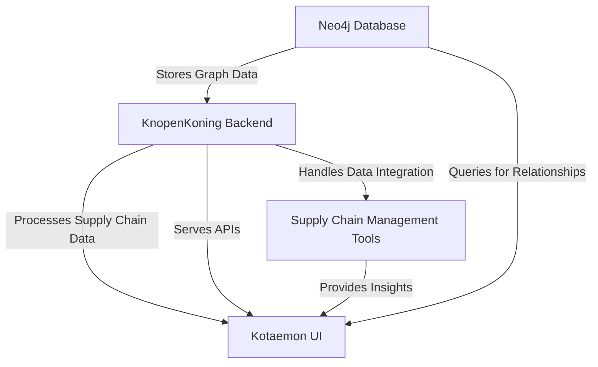
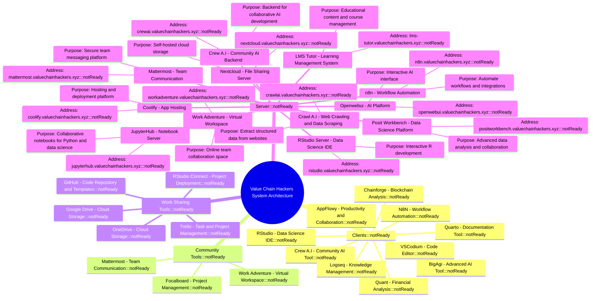

# VCH-Infra

here is an overview

Server IP: 148.251.4.42

| **Service Name**       | **Purpose**                          | **Address**                                                    | **Status**       |
|-------------------------|--------------------------------------|----------------------------------------------------------------|------------------|
| **Openwebui**          | AI Platform                         | [https://openwebui.valuechainhackers.xyz](https://openwebui.valuechainhackers.xyz)    | Not Ready        |
| **Coolify**            | App Hosting                         | [https://coolify.valuechainhackers.xyz](https://coolify.valuechainhackers.xyz)      | Not Ready        |
| **Nextcloud**          | File Sharing Server                 | [https://nextcloud.valuechainhackers.xyz](https://nextcloud.valuechainhackers.xyz)    | Not Ready        |
| **Work Adventure**     | Virtual Workspace                   | [https://workadventure.valuechainhackers.xyz](https://workadventure.valuechainhackers.xyz) | Not Ready        |
| **n8n**                | Workflow Automation                 | [https://n8n.valuechainhackers.xyz](https://n8n.valuechainhackers.xyz)              | Not Ready        |
| **Posit Workbench**    | Data Science Platform               | [https://positworkbench.valuechainhackers.xyz](https://positworkbench.valuechainhackers.xyz) | Not Ready        |
| **RStudio Server**     | Data Science IDE                    | [https://rstudio.valuechainhackers.xyz](https://rstudio.valuechainhackers.xyz)      | Not Ready        |
| **JupyterHub**         | Notebook Server                     | [https://jupyterhub.valuechainhackers.xyz](https://jupyterhub.valuechainhackers.xyz) | Not Ready        |
| **Mattermost**         | Team Communication                  | [https://mattermost.valuechainhackers.xyz](https://mattermost.valuechainhackers.xyz) | Not Ready        |
| **Crawl A.I**          | Web Crawling and Data Scraping      | [https://crawlai.valuechainhackers.xyz](https://crawlai.valuechainhackers.xyz)      | Not Ready        |
| **Crew A.I**           | Community AI Backend                | [https://crewai.valuechainhackers.xyz](https://crewai.valuechainhackers.xyz)        | Not Ready        |
| **LMS Tutor**          | Learning Management System          | [https://lms-tutor.valuechainhackers.xyz](https://lms-tutor.valuechainhackers.xyz)  | Not Ready        |
| **Kotaemon**           | Assessment and Evaluation System    | [https://kotaemon.valuechainhackers.xyz](https://kotaemon.valuechainhackers.xyz)    | Not Ready        |
| **Neo4j**              | Graph Database                      | [https://neo4j.valuechainhackers.xyz](https://neo4j.valuechainhackers.xyz)          | Not Ready        |
