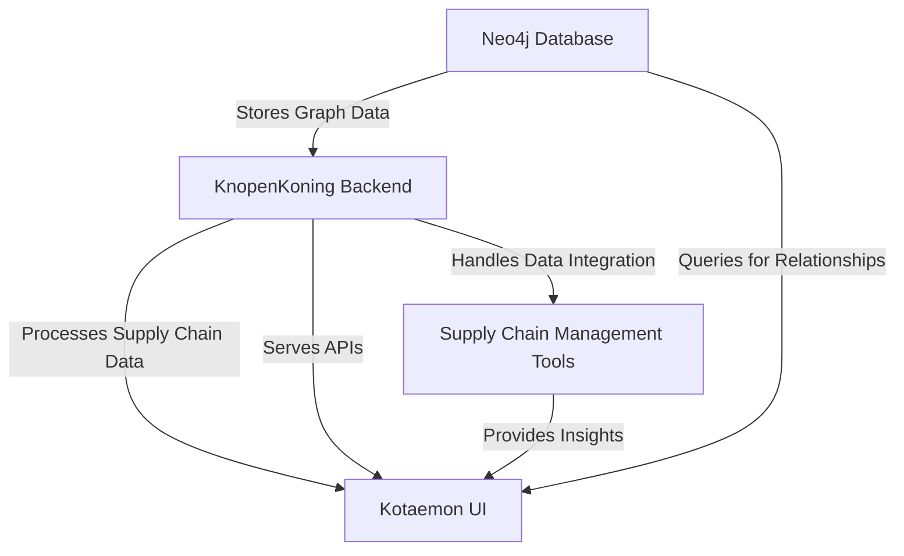
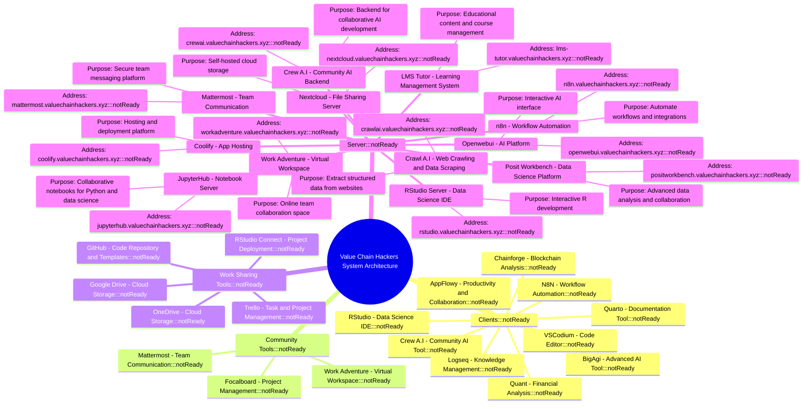

# VCH-Infra

```mermaid
graph TD
    A[Neo4j Database] -->|Stores Graph Data| B[KnopenKoning Backend]
    B -->|Processes Supply Chain Data| C[Kotaemon UI]
    B -->|Serves APIs| C
    A -->|Queries for Relationships| C
    B -->|Handles Data Integration| D[Supply Chain Management Tools]
    D -->|Provides Insights| C
```

```mermaid
mindmap
  root((Value Chain Hackers System Architecture))
    Clients:::notReady
      N8N - Workflow Automation:::notReady
      RStudio - Data Science IDE:::notReady
      Quarto - Documentation Tool:::notReady
      Quant - Financial Analysis:::notReady
      Crew A.I - Community AI Tool:::notReady
      Chainforge - Blockchain Analysis:::notReady
      BigAgi - Advanced AI Tool:::notReady
      Logseq - Knowledge Management:::notReady
      AppFlowy - Productivity and Collaboration:::notReady
      VSCodium - Code Editor:::notReady
    Community Tools:::notReady
      Mattermost - Team Communication:::notReady
      Work Adventure - Virtual Workspace:::notReady
      Focalboard - Project Management:::notReady
    Work Sharing Tools:::notReady
      GitHub - Code Repository and Templates:::notReady
      OneDrive - Cloud Storage:::notReady
      Google Drive - Cloud Storage:::notReady
      RStudio Connect - Project Deployment:::notReady
      Trello - Task and Project Management:::notReady
    Server:::notReady
      Openwebui - AI Platform  
        Purpose: Interactive AI interface  
        Address: openwebui.valuechainhackers.xyz:::notReady
      Coolify - App Hosting  
        Purpose: Hosting and deployment platform  
        Address: coolify.valuechainhackers.xyz:::notReady
      Nextcloud - File Sharing Server  
        Purpose: Self-hosted cloud storage  
        Address: nextcloud.valuechainhackers.xyz:::notReady
      Work Adventure - Virtual Workspace  
        Purpose: Online team collaboration space  
        Address: workadventure.valuechainhackers.xyz:::notReady
      n8n - Workflow Automation  
        Purpose: Automate workflows and integrations  
        Address: n8n.valuechainhackers.xyz:::notReady
      Posit Workbench - Data Science Platform  
        Purpose: Advanced data analysis and collaboration  
        Address: positworkbench.valuechainhackers.xyz:::notReady
      RStudio Server - Data Science IDE  
        Purpose: Interactive R development  
        Address: rstudio.valuechainhackers.xyz:::notReady
      JupyterHub - Notebook Server  
        Purpose: Collaborative notebooks for Python and data science  
        Address: jupyterhub.valuechainhackers.xyz:::notReady
      Mattermost - Team Communication  
        Purpose: Secure team messaging platform  
        Address: mattermost.valuechainhackers.xyz:::notReady
      Crawl A.I - Web Crawling and Data Scraping  
        Purpose: Extract structured data from websites  
        Address: crawlai.valuechainhackers.xyz:::notReady
      Crew A.I - Community AI Backend  
        Purpose: Backend for collaborative AI development  
        Address: crewai.valuechainhackers.xyz:::notReady
      LMS Tutor - Learning Management System  
        Purpose: Educational content and course management  
        Address: lms-tutor.valuechainhackers.xyz:::notReady
```

here is an overview

```mermaid

classDiagram
  class Server {
    Name: Value Chain Hacker Main Server
    IP: 192.168.1.100
    Status: Active
    Configuration: Dockerized Services
  }

  class Openwebui {
    Name: Openwebui
    Purpose: AI Platform
    IP: 192.168.1.101
    Status: Active
  }

  class Coolify {
    Name: Coolify
    Purpose: App Hosting
    IP: 192.168.1.102
    Status: Maintenance
  }

  class Nextcloud {
    Name: Nextcloud
    Purpose: File Sharing Server
    IP: 192.168.1.103
    Status: Active
  }

  class WorkAdventure {
    Name: Work Adventure
    Purpose: Virtual Workspace
    IP: 192.168.1.104
    Status: Active
  }

  class n8n {
    Name: n8n
    Purpose: Workflow Automation
    IP: 192.168.1.105
    Status: Active
  }

  class PositWorkbench {
    Name: Posit Workbench
    Purpose: Data Science Platform
    IP: 192.168.1.106
    Status: Maintenance
  }

  class RStudioServer {
    Name: RStudio Server
    Purpose: Data Science IDE
    IP: 192.168.1.107
    Status: Active
  }

  class JupyterHub {
    Name: JupyterHub
    Purpose: Notebook Server
    IP: 192.168.1.108
    Status: Active
  }

  class Mattermost {
    Name: Mattermost
    Purpose: Team Communication
    IP: 192.168.1.109
    Status: Active
  }

  class CrawlAI {
    Name: Crawl A.I
    Purpose: Web Crawling and Data Scraping
    IP: 192.168.1.110
    Status: Maintenance
  }

  class CrewAI {
    Name: Crew A.I
    Purpose: Community AI Backend
    IP: 192.168.1.111
    Status: Active
  }

  class LMSTutor {
    Name: LMS Tutor
    Purpose: Learning Management System
    IP: 192.168.1.112
    Status: Development
  }

  %% Relationships
  Server <|-- Openwebui
  Server <|-- Coolify
  Server <|-- Nextcloud
  Server <|-- WorkAdventure
  Server <|-- n8n
  Server <|-- PositWorkbench
  Server <|-- RStudioServer
  Server <|-- JupyterHub
  Server <|-- Mattermost
  Server <|-- CrawlAI
  Server <|-- CrewAI
  Server <|-- LMSTutor

```
